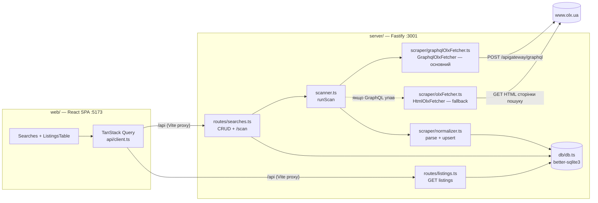

# Архітектура — OLX Dashboard

> Технічний огляд реалізації. Канон вимог і рішень — у [`olx-monitor-spec.md`](./olx-monitor-spec.md).
> Деталі запитів до OLX (URL, параметри, заголовки, селектори) — у [`olx-api.md`](./olx-api.md).
> Дерево файлів і призначення кожного модуля — у [`structure.md`](./structure.md).
> Інваріанти й конвенції, обовʼязкові при змінах, — у [`../CLAUDE.md`](../CLAUDE.md).

## 1. Огляд

Персональна single-user система моніторингу оголошень OLX.ua: збір через GraphQL API OLX
(fallback — HTML) → SQLite → React-таблиця. Локальний запуск, без зовнішніх сервісів
(Notion/cron — пізніші етапи).

Поточний стан: **реалізовано Етап 1 (MVP)**, включно з міграцією збору на GraphQL
(основний метод; HTML — fallback, [`plans/graphql-migration.md`](./plans/graphql-migration.md))
і міграцією фронтенду на Chakra UI v3. Етапи 2–4 — у
[`olx-monitor-spec.md` §12](./olx-monitor-spec.md).

## 2. Стек

| Шар | Технологія |
| --- | --- |
| Monorepo | npm workspaces (`server/` + `web/`) |
| Backend | Node.js 20+, TypeScript (strict), Fastify 5, better-sqlite3 (синхронний), cheerio |
| Frontend | React 18, Vite 6, TanStack Query v5, TanStack Table v8, Chakra UI v3 (+ next-themes) |
| Збір даних | GraphQL `POST /apigateway/graphql` (основний); `fetch` + cheerio HTML-парсинг (fallback). БЕЗ браузера/Playwright |

## 3. Архітектура та потік даних

**Сценарій сканування** (`POST /api/searches/:id/scan` або CLI `npm run scan`):

1. `scanner.runScan(searchId, options?: { deep?: boolean })` читає рядок `searches`,
   парсить `api_filters` (JSON) у `SearchConfig`.
2. Створює запис у `scan_runs` (`started_at`, `kind` = `'deep'` якщо `options.deep`, інакше
   `'normal'`).
3. `GraphqlOlxFetcher.fetchSearch(search, options?)` шле ≤3 POST-запити (offset 0/40/80,
   затримка 1–2 с, заголовки з [`olx-api.md` §2.3](./olx-api.md)) → структуровані
   `RawListing[]` (ціна числом, ISO-дати, `params`) + `exhausted` (остання сторінка `< 40`).
   Якщо GraphQL упав — scanner автоматично повторює скан через `HtmlOlxFetcher`
   (cheerio-парсинг сторінки пошуку, `exhausted` завжди `false`) і фіксує позначку fallback
   у `scan_runs.error`. При `options.deep` — батчі по 3 запити з паузою 3–6 с,
   ціль `min(26, ceil(visible_total_count/40))` (26 = межа вікна пагінації GraphQL OLX,
   `offset ≤ 1000`; деталі — `olx-api.md` §2.9). Якщо GraphQL вперся у це вікно посеред
   скану (`ListingError` на `offset > 0` з уже зібраними оголошеннями) — скан завершується
   **частковим успіхом** (`exhausted=false`, `warning` записується у `scan_runs.error`),
   HTML-fallback не запускається. Після кожного запиту/сторінки викликається
   `options.onProgress(done, total)`, який scanner записує у
   `scan_runs.requests_done`/`requests_total`.
4. `normalizer.upsertListings()` використовує структуровані поля (GraphQL) або парсить сирі
   рядки (HTML), робить upsert по `olx_id` у транзакції, рахує `new_count`, оновлює
   `filtered_out` (`localFilters.evaluateFilteredOut`) і — для GraphQL-даних — застосовує
   миттєвий `olx_status`-disable/reactivate.
5. Якщо фетчер був GraphQL (не fallback) і скан успішний — `statusEngine.applyScanStatuses(searchId,
   fetched, exhausted)` застосовує вікно покриття (`miss_count`/disable, §6.1
   [`olx-monitor-spec.md`](./olx-monitor-spec.md)) і повертає `disabled_count`.
6. `scan_runs` оновлюється (`finished_at`, `found`, `new_count`, `disabled_count`); падіння
   обох стратегій → `scan_runs.error`, виняток прокидається в роут (HTTP 500), **процес не
   падає**.
7. Web інвалідовує кеш `listings`/`search-stats` і перемальовує таблицю/панель дій.

> **Verify-сценарій (заплановано, A3):** окремий `kind='verify'` прохід без фетчера видачі —
> бере кандидатів за `last_seen_at`/`status_source='auto'`, відкриває сторінки оголошень
> напряму (`fetch`, батч-патерн deep scan) і застосовує disable/reactivate за детектом
> мертвої сторінки. Деталі — [`olx-monitor-spec.md` §6.3](./olx-monitor-spec.md).

## 4. Модулі бекенду

| Модуль | Відповідальність |
| --- | --- |
| `db/db.ts` | Відкриває `server/data/olx.db`, вмикає WAL + foreign_keys, застосовує `schema.sql` при старті, далі `addColumnIfMissing` для дрібних додавань колонок і `migrateListingsTable()` (rebuild `listings` під `PRAGMA user_version=2`: новий CHECK статусів + `miss_count`). Бекфіл `searches.sort_order`. Експортує singleton `db`. |
| `db/schema.sql` | Канонічна схема (4 таблиці). Єдине джерело визначень — не дублювати в коді. |
| `types.ts` | Доменні типи (`SearchConfig`, `RawListing`, `ScanResult`, `ListingRow`, `ListingStatus`/`LISTING_STATUSES`, `ListingPatch`, `LocalFilters`, `ParamKeyInfo`, `LastScanInfo`, `SearchStats`, `FetchOptions`, `ScanStatus`, інтерфейс `OlxFetcher`). Без `any`. |
| `scraper/graphqlOlxFetcher.ts` | `GraphqlOlxFetcher implements OlxFetcher` (основний): POST на GraphQL-ендпойнт, `searchParameters` з `SearchConfig`, маппінг відповіді → структуровані `RawListing[]` + `exhausted` (остання сторінка `< 40` елементів). Підтримує `options.deep` (батчі по 3 з паузами 3–6с, ціль за `visible_total_count`, завжди обмежена `MAX_PAGES=26` — вікно пагінації OLX `offset≤1000`) і `options.onProgress`. `ListingError` на `offset>0` з уже зібраними даними → частковий успіх (`warning` замість виключення). Деталі — `olx-api.md` §2. |
| `scraper/selectors.ts` | Усі OLX-селектори + заголовки HTML-запиту в одному місці (для fallback). |
| `scraper/olxFetcher.ts` | `HtmlOlxFetcher implements OlxFetcher` (fallback №1): побудова URL, fetch, cheerio-парсинг, guard на JS-only сторінку. Той самий `FetchOptions`/глибокий режим (без уточнення цілі за `visible_total_count` — одразу `DEEP_SAFETY_CAP`); `exhausted` завжди `false`. |
| `scraper/dateParser.ts` | `parseOlxDate(raw, now?) → string \| null` — текстові дати HTML-fallback («Сьогодні/Вчора о HH:MM», «D <місяць_родовий> YYYY р.») → ISO (`YYYY-MM-DD[THH:MM:00]`), сумісний з ISO-датами GraphQL для коректного порівняння у `statusEngine.ts`. Нерозпізнане → `null`. |
| `scraper/normalizer.ts` | `upsertListings` (upsert по `olx_id`): пріоритет структурованим полям (GraphQL); для HTML — `parsePrice`, розбір локації/дати + `dateParser.parseOlxDate` для `posted_at` (завжди ISO або `NULL`, ніколи сирий текст). На insert/update — миттєвий `status='disabled'` за `olx_status ≠ 'active'` (для `auto`/`rejected`, з позначкою в `note`) і auto-reactivate; рахує `filtered_out` через `localFilters.evaluateFilteredOut`. |
| `scraper/statusEngine.ts` | `applyScanStatuses(searchId, fetched, exhausted) → {disabled_count}` (Етап 2, A2) — вікно покриття: `windowFloor = min(posted_at)` отриманих (`null`, якщо `exhausted`), кандидати поза вікном дістають `miss_count += 1`, при `>= 2` (auto/rejected) → `disabled`. Викликається з `scanner.ts` лише для успішних GraphQL-сканів. |
| `scraper/localFilters.ts` | `evaluateFilteredOut(filters, listing) → boolean` (Етап 2, A4) — стоп-слова (case-insensitive підрядок у title+description) і числові діапазони по `params[key]` (перше число в label). Чиста функція, використовується `normalizer.ts` і `routes/searches.ts` (ретроактивний перерахунок). |
| `scraper/verifier.ts` | ⏳ Заплановано (A3, не реалізовано) — вибірка `last_seen_at`-кандидатів, GET сторінок оголошень батчами, детект мертвих сторінок (маркер визначити live), застосування disable/reactivate. |
| `scanner.ts` | `runScan(searchId, options?: { deep?: boolean })` — спільна логіка для HTTP-роута і CLI; GraphQL → HTML fallback; пише `scan_runs.kind` (`normal`/`deep`); після upsert викликає `statusEngine.applyScanStatuses` лише якщо скан GraphQL; веде `scan_runs` (включно з `requests_done`/`requests_total` через `onProgress`, `disabled_count`). |
| `routes/searches.ts` | CRUD `/api/searches[/:id]` (PATCH з `local_filters` → ретроактивний перерахунок `filtered_out`) + `POST /:id/move` + `POST /:id/scan` (`?deep=true`) + `GET /:id/scan-status` + `GET /:id/param-keys` + `GET /:id/stats`. |
| `routes/listings.ts` | `GET /api/searches/:id/listings` з білим списком колонок для сортування + `PATCH /api/listings/:id` (`{status?, note?}`, валідація `LISTING_STATUSES`, зміна статусу → `status_source='manual'`, `miss_count=0`). |
| `index.ts` | Fastify bootstrap, CORS для `:5173`, `/health`, слухає `:3001`. |
| `scan.ts` | CLI-обгортка над `runScan` (`npm run scan -- --search <id>`). |
| `migratePostedAt.ts` | Одноразова CLI-міграція (`npm run migrate:posted-at`): конвертує наявні текстові `posted_at` (старий HTML-fallback) через `dateParser.parseOlxDate` в ISO; нерозпізнане → `NULL`. Виводить кількість конвертованих/занулених. |

## 5. Схема БД

Канон — [`server/src/db/schema.sql`](../server/src/db/schema.sql) (детальний опис полів у
[`olx-monitor-spec.md` §5](./olx-monitor-spec.md)). Таблиці: `searches`, `listings`,
`price_history`, `scan_runs`.

Ключові інваріанти (повний перелік — у [`../CLAUDE.md`](../CLAUDE.md)):
- `listings.olx_id` UNIQUE — ключ дедуплікації (upsert).
- `status` ∈ `new|interested|contacted|rejected|disabled`; `status_source` ∈ `auto|manual`;
  `miss_count` — лічильник сканів поспіль без оголошення у вікні покриття.
- `params` зберігається сирим JSON.
- `filtered_out` — прапорець локальних фільтрів (`local_filters`), рядок не видаляється.
- `searches.sort_order` — ручний порядок у списку (менше → вище); бекфіл існуючих рядків
  (`0..N-1` за `created_at DESC`) виконує `db.ts` при старті, нові пошуки отримують
  `MIN(sort_order) - 1` (з'являються згори).

> `price_history` створена у схемі, але кодом ще не наповнюється (Етап 3).

## 6. REST API

| Метод | Шлях | Стан |
| --- | --- | --- |
| `GET/POST/PATCH/DELETE` | `/api/searches[/:id]` | ✅ Етап 1/2 — `GET` сортує за `sort_order ASC, created_at DESC, id DESC`; `DELETE` каскадний (`price_history` → `scan_runs` → `listings` → `searches`, у транзакції); `PATCH` з `local_filters` (Етап 2) → зберігає + синхронно перераховує `filtered_out` для всіх рядків пошуку, повертає `filtered_out_count` |
| `POST` | `/api/searches/:id/move` | ✅ — `{direction: 'up'\|'down'}`, міняє `sort_order` із сусідом за поточним порядком (для кнопок ↑/↓ у sidebar) |
| `POST` | `/api/searches/:id/scan?deep=true` | ✅ Етап 1/2 — повертає `{found, new_count, requestsUsed, disabled_count}`; `deep=true` — глибокий скан (§2.9 `olx-api.md`); `disabled_count` — результат `statusEngine` (Етап 2, лише GraphQL-скани) |
| `POST` | `/api/searches/:id/scan?verify=true` | ⏳ Етап 2 (A3) — verify-прохід для давно не бачених оголошень, заплановано |
| `GET` | `/api/searches/:id/scan-status` | ✅ Етап 1/2 — останній рядок `scan_runs` (для поллінгу прогресу глибокого скану/verify) |
| `GET` | `/api/searches/:id/listings?sort=&order=` | ✅ Етап 1 |
| `GET` | `/api/searches/:id/param-keys` | ✅ Етап 2 — `{key, samples}[]` для конструктора діапазонів локальних фільтрів |
| `GET` | `/api/searches/:id/stats` | ✅ Етап 2 — `{in_db, stale_count, last_scan}` для панелі дій пошуку |
| `PATCH` | `/api/listings/:id` | ✅ Етап 2 — `{status?, note?}`; зміна `status` → `status_source='manual'`, `miss_count=0` |
| `GET` | `/health` | ✅ |
| `GET` | `/api/listings/:id/price-history` | ⏳ Етап 3 |
| `GET` | `/api/listings/:id/export/markdown` | ⏳ Етап 3 |
| `POST` | `/api/searches/:id/export/notion` | ⏳ Етап 4 |

## 7. Frontend

- `api/client.ts` — fetch-обгортка + TanStack Query хуки: `useSearches`, `useCreateSearch`,
  `useDeleteSearch`, `useReorderSearches`, `useScan`, `useScanStatus`, `useSearchStats`,
  `useListings`, `useUpdateListing`, `useParamKeys`, `useUpdateSearchFilters`. Всі типи DTO
  імпортуються з `types/index.ts`. Форма пошуку маппить «ціна від/до» у
  `api_filters.ranges.price`. `useScan` приймає `{searchId, deep?}` і має
  `mutationKey: ['scan']` (щоб `useAutoRefresh` міг перевірити `queryClient.isMutating`),
  інвалідовує `['listings', searchId]` і `['search-stats', searchId]`; `useScanStatus(searchId,
  enabled)` поллить `GET .../scan-status` раз на ~1.5с, поки `enabled`; `useSearchStats(searchId)`
  тягне `GET /api/searches/:id/stats` для панелі дій. `useUpdateListing()` —
  `PATCH /api/listings/:id` (`{status?, note?}`) з оптимістичним апдейтом кешу
  `['listings', searchId]`. `useParamKeys(searchId, enabled)` — `GET .../param-keys` (для
  конструктора діапазонів, увімкнено лише коли відкрито `SearchFiltersDrawer`).
  `useUpdateSearchFilters()` — `PATCH /api/searches/:id` з `local_filters`, інвалідовує
  `['searches']` і `['listings', searchId]`, повертає `filtered_out_count`. `useDeleteSearch`
  інвалідовує `['searches']` і прибирає кеш `['listings', id]`; `useReorderSearches` шле
  `POST /api/searches/:id/move` і інвалідовує `['searches']`.
- `types/index.ts` — централізований файл з усіма фронтенд-типами: `Listing` (включно з
  `status`, `status_source`, `note`, `filtered_out`, `miss_count`, `olx_status`),
  `ListingStatus`/`LISTING_STATUSES`, `ListingPatch`, `LocalFilters`, `ParamKeyInfo`,
  `LastScanInfo`, `SearchStats`, `Search` (включно з `sort_order`, `visible_total_count`,
  `local_filters`), `NewSearchInput`, `StoredTableState` тощо — дзеркало відповідних типів
  `server/src/types.ts`.
- `utils/storage.ts` — хелпери для взаємодії з `localStorage`: загальні `loadSettings`/`saveSettings`
  над одним обʼєктом `SETTINGS_STORAGE_KEY` (поля `columnVisibility`, `descriptionExpandEnabled`
  (дефолт `true`), `autoRefreshEnabled`/`autoRefreshIntervalMin` (дефолт `false`/`30`),
  `skipDeepScanConfirm`) + окремо стан таблиці `TABLE_STORAGE_KEY` (сортування/розміри
  колонок/`pageSize`, дефолт `DEFAULT_PAGE_SIZE = 50`).
- `utils/format.ts` — хелпери форматування ціни (`formatPrice`), форматування дати
  (`formatDate`), відносного часу (`formatRelativeTime`, напр. «3 год тому» — для рядка
  стану панелі дій) та чистки HTML-опису (`stripDescriptionHtml`).
- `utils/status.ts` — `STATUS_LABELS`/`STATUS_COLORS` (Record по `ListingStatus`: `new` blue,
  `interested` green, `contacted` purple, `rejected` gray, `disabled` red) та
  `isMutedStatus(status)` (`disabled`/`rejected` → приглушений рядок).
- `hooks/useListingsTableState.ts` — кастомний React-хук для збереження та завантаження стану сортування, розмірів колонок та пагінації (`pageSize` персиститься, `pageIndex` — ні) таблиці.
- `hooks/useAutoRefresh.ts` — `useAutoRefresh(enabled, intervalMin)`: поки увімкнено і вкладка
  видима, раз на `intervalMin` хвилин послідовно запускає `useScan({deep:false})` для всіх
  пошуків (пауза 5–10с між ними), пропускаючи тік якщо вже триває скан
  (`queryClient.isMutating({mutationKey:['scan']})`). Toast на старті і підсумковий
  (`+N нових` або тихий «новин немає»). Глибокий скан/verify не запускає.
- `components/table/` — ізольовані компоненти таблиці оголошень:
  - `HeaderLabel.tsx` — заголовок колонки з відповідною Lucide-іконкою.
  - `columns.tsx` — визначення колонок для TanStack Table (включно з display-колонкою
    `select` для bulk-дій, 36px, `enableSorting/enableResizing/enableHiding: false`) та
    список `TOGGLEABLE_COLUMNS` (без `select`).
  - `ListingsTableHeader.tsx` — заголовок таблиці `<thead>` із підтримкою сортування та
    ресайзу колонок (`columnResizeMode: 'onEnd'`); ресайз-хендл рендериться лише якщо
    `header.column.getCanResize()`.
  - `ListingsTableBody.tsx` — тіло таблиці `<tbody>`, яке рендерить рядки.
  - `ListingsTableRow.tsx` — рядок таблиці. **Увага:** не використовуйте `React.memo` для
    цього компонента, оскільки TanStack Table не перестворює об'єкти `row` при зміні
    порядку чи видимості колонок. З `memo` зміна `columnOrder` ламає вирівнювання хедерів
    відносно даних. Рядки `status='disabled'`/`'rejected'` — приглушені (`isMutedStatus`).
  - `StatusCell.tsx` — компактний `NativeSelect` зі статусом у вигляді кольорового
    бейджа (`STATUS_COLORS`); зміна → `useUpdateListing()` (`status_source='manual'`,
    `miss_count=0`).
  - `NoteCell.tsx` — обрізаний текст нотатки (`lineClamp 2`); клік відкриває
    `Popover.Root`/`Portal` з `Textarea` + кнопкою «Зберегти» (PATCH `note`). Portal —
    рендериться в `document.body`, не обмежений `overflow:auto` контейнером таблиці.
  - `HighlightText.tsx` — підсвічує всі збіги пошукового запиту в тексті через
    `<Mark bg="yellow.subtle">`; використовується в колонках «Назва»/«Опис» і в
    `DescriptionTooltip`.
  - `ListingsFilterBar.tsx` — панель над таблицею: `SegmentGroup` фільтра статусів (Всі +
    `LISTING_STATUSES`, з лічильниками з урахуванням toggle filtered_out), `Switch`
    «Показати відфільтровані», `Input` текстового пошуку.
  - `BulkActionBar.tsx` — з'являється, коли є вибрані рядки: «Вибрано: N» + `Menu` зі
    статусами (`LISTING_STATUSES`/`STATUS_LABELS`) → `Promise.allSettled` з
    `useUpdateListing().mutateAsync()` по кожному `id` (підсумковий toast), і «Скасувати»
    (`setRowSelection({})`).
  - `DescriptionTooltip.tsx` — інтерактивний тултіп з прокруткою для попереднього перегляду тексту опису. Клік по вмісту відкриває `DescriptionDialog`.
  - `TablePagination.tsx` — панель пагінації під таблицею: `Pagination.Root` (Chakra UI v3) з номерами сторінок, prev/next, текстом «N–M з T» та селектором розміру сторінки (25/50/100/200). Прихована, якщо рядків ≤ 25.
- `App.tsx` — компоновка сторінки (Header, Searches sidebar, ListingsTable). `selectedId` може стати `null` (видалення активного пошуку) — тоді `ListingsTable` показує заглушку «Обери пошук зліва». `useAutoRefresh(autoRefreshEnabled, autoRefreshIntervalMin)` викликається тут.
- `components/Header.tsx` — шапка сайту («OLX Dashboard» + бейдж «авто: N хв» (`LuTimer`), видимий лише коли `autoRefreshEnabled`, кнопка згортання бічної панелі, інформація про активний обраний пошук з підсвіткою та `SettingsDrawer`).
- `components/DescriptionDialog.tsx` — модальне вікно повного опису оголошення (`DialogRoot
  size="lg" placement="center" scrollBehavior="inside"`): фото/назва/ціна/місто в хедері,
  повний текст опису (скрол) у тілі, «Відкрити на OLX» + «Закрити» у футері. Відкривається
  кліком по комірці «Опис» (`ListingsTable.tsx` тримає `descriptionListing` стан).
- `components/SearchActionPanel.tsx` — постійна панель дій вибраного пошуку (рендериться в
  `App.tsx` над `<Searches>`/`<ListingsTable>`): рядок стану з `useSearchStats()` («На OLX:
  X · У базі: N · Давно не бачених: M» + «Останній скан: <відносний час> (<вид>) · +N нових
  · M вимкнено», іконка `LuTriangleAlert` з tooltip при `last_scan.error`); кнопки «Швидкий
  скан»/«Глибокий скан» (`useScan`, обидві `disabled` під час будь-якого скану цього пошуку,
  прогрес — `useScanStatus`-поллінг, `Progress.Root`); «Перевірити неактивні (N)» — стала
  `disabled`-заглушка з tooltip (показує `stats.stale_count`, чекає A3). «Глибокий скан»
  відкриває `ConfirmActionDialog` (якщо не `skipDeepScanConfirm`) з оцінкою
  `min(50, ceil(visible_total_count/40))` запитів і часу.
- `components/SearchFiltersDrawer.tsx` — Drawer редактора `local_filters` (відкривається з
  3-dot меню пошуку → «Фільтри»): стоп-слова як `Tag.Root` chips + `Input` з Enter; діапазони
  — рядки `NativeSelect` (ключі з `useParamKeys`) + `Input` мін/макс + кнопка видалення,
  «Додати правило». «Зберегти» → `useUpdateSearchFilters()` → toast з
  `filtered_out_count`.
- `components/ConfirmActionDialog.tsx` — спільний діалог підтвердження довгої дії
  (`DialogRoot role="alertdialog"`, патерн діалогу видалення пошуку): title/description/
  confirmLabel + `Checkbox` «Більше не питати» (`onConfirm(skipNextTime)`). Використовується
  для глибокого скану в `SearchActionPanel`; для verify — заплановано (A3).
- `components/Searches.tsx` — акордеон («Пошуки» / «Новий пошук»), форма створення. Кожен `SearchRow`:
  - кнопки `LuChevronUp`/`LuChevronDown` для ручного сортування (`useReorderSearches`),
    disabled на краях списку;
  - 3-dot меню (`Menu.Root`, іконка `LuEllipsisVertical`) — «Фільтри» (`LuFilter`, відкриває
    `SearchFiltersDrawer`), розділювач, «Видалити» (`LuTrash2`, `color="fg.error"`,
    відкриває `DialogRoot role="alertdialog"` із підтвердженням і каскадно видаляє пошук
    через `useDeleteSearch`; якщо видалено активний пошук — `onSelect(null)`).
  Кнопки сканування й прогрес-бар перенесені в `SearchActionPanel` (B4) — у 3-dot меню їх
  більше немає.
- `pages/ListingsTable.tsx` — відображення списку оголошень: збирає разом
  `useListingsTableState`, колонки, `ListingsFilterBar` (фільтр статусу + toggle
  filtered_out + текстовий пошук → `globalFilter`/`globalFilterFn` по title+description),
  `BulkActionBar` (за наявності `rowSelection`), `ListingsTableHeader`/`ListingsTableBody`/
  `TablePagination`/`DescriptionDialog`. `rowSelection` (`getRowId: row => String(row.id)`,
  `enableRowSelection: true`) скидається при зміні `searchId`. Клієнтська пагінація через
  `getPaginationRowModel()` (TanStack Table v8) тримає DOM обмеженим розміром сторінки навіть
  для ~2000 оголошень (фікс зависання UI після глибокого скану — `docs/plans/listings-pagination.md`).
  Експортує `TOGGLEABLE_COLUMNS` для збереження зворотньої сумісності з `SettingsDrawer`.
- `App.tsx` — шапка («OLX Dashboard» + бейдж «авто: N хв» (`LuTimer`), видимий лише коли
  `autoRefreshEnabled`, + `SettingsDrawer`); під шапкою — `SearchActionPanel` для обраного
  пошуку (замінив попередній рядок «Результатів на OLX… · У базі…»); далі `Searches`
  (sidebar) + `ListingsTable`. `selectedId` може стати `null` (видалення активного пошуку) —
  тоді `ListingsTable` показує заглушку «Обери пошук зліва». `useAutoRefresh(autoRefreshEnabled,
  autoRefreshIntervalMin)` викликається тут.
- `components/settings/SettingsDrawer.tsx` — Drawer «Налаштування» (іконка-шестерня в шапці, `App.tsx`), що єднає три підкомпоненти з `web/src/components/settings/sections/`:
  - `VisualSection.tsx` — розділ «Візуальний вигляд»: перемикач теми light/dark (`useColorMode` з `@chakra-ui/react`), перемикач «Розширений перегляд опису (тултіп + модалка)» (`descriptionExpandEnabled`);
  - `AutoRefreshSection.tsx` — розділ «Автооновлення»: `Switch` автооновлення + `NativeSelect` вибору інтервалу (15/30/60 хв);
  - `ColumnsSection.tsx` — розділ «Колонки таблиці»: чекбокси видимості колонок таблиці (`TOGGLEABLE_COLUMNS`).
  Усі налаштування персистяться в `localStorage` (за допомогою хелперів із `web/src/utils/storage.ts`).
- `components/ui/` — Chakra UI v3 snippets, здебільшого додані через
  `npx @chakra-ui/cli snippet add` (`provider`, `color-mode`, `toaster`, `tooltip`, `drawer`,
  `switch`, `checkbox`, `close-button`); `dialog.tsx` написаний вручну за тим самим патерном
  (`DialogRoot`/`DialogContent`/`DialogHeader`/`DialogBody`/`DialogFooter`/`DialogCloseTrigger`/
  `DialogBackdrop`) — використовується `DescriptionDialog`, `ConfirmActionDialog` і діалогом
  підтвердження видалення.
- Vite proxy `/api → http://localhost:3001` (див. `web/vite.config.ts`).

## 8. Обробка помилок збору

- Ланцюжок стратегій: **GraphQL → HTML (автоматично в scanner) → `__NEXT_DATA__` →
  headed Playwright** (останні два не реалізовані — рішення людини).
- GraphQL-помилки (HTTP ≠ 200, `errors[]`, `ListingError`) → виняток → scanner пробує
  `HtmlOlxFetcher`; при успіху fallback скан вважається успішним, але в `scan_runs.error`
  пишеться позначка `graphql failed: ...; fallback html OK`.
- Падіння обох стратегій не валить процес: повна помилка у `scan_runs.error`, скан failed,
  попередні дані лишаються.
- Частковий успіх GraphQL (вікно пагінації `offset≤1000` вичерпано посеред скану,
  `docs/plans/graphql-offset-window.md`) — скан вважається успішним, зібрані дані
  зберігаються, `warning` (`graphql window cap hit at offset=<N>`) пишеться у
  `scan_runs.error`.
- Якщо HTML-сторінка не дала карток і немає `empty-state` — `HtmlOlxFetcher` **кидає виняток із
  зразком HTML** і ознакою наявності `__NEXT_DATA__`, а не переходить на браузер автоматично.
- Діагностика поломок — чекліст [`olx-api.md` §5](./olx-api.md).

## 9. Відомі відхилення від початкового канону

- 2026-06-10: заголовок HTML-картки OLX мігрував з `h6` на `h4` — селектор розширено до
  `h6, h4` (`server/src/scraper/selectors.ts`). Решта селекторів підтверджені робочими.
- 2026-06-10: канон змінено — основним методом збору став GraphQL (раніше: static HTML;
  заборону `api/v1/offers` знято після підтвердження живим тестом). Деталі —
  [`olx-api.md`](./olx-api.md), план — [`plans/graphql-migration.md`](./plans/graphql-migration.md).
