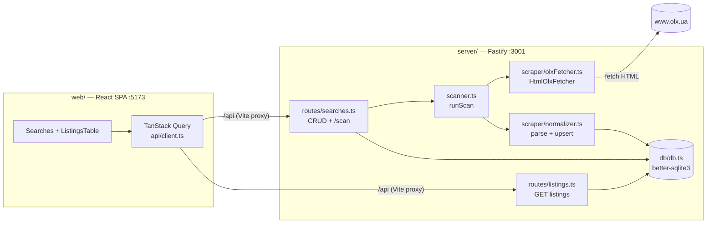

# Архітектура — OLX Monitor

> Технічний огляд реалізації. Канон вимог і рішень — у [`olx-monitor-spec.md`](./olx-monitor-spec.md).
> Дерево файлів і призначення кожного модуля — у [`structure.md`](./structure.md).
> Інваріанти й конвенції, обовʼязкові при змінах, — у [`../CLAUDE.md`](../CLAUDE.md).

## 1. Огляд

Персональна single-user система моніторингу оголошень OLX.ua: збір через HTTP+HTML →
SQLite → React-таблиця. Локальний запуск, без зовнішніх сервісів (Notion/cron — пізніші етапи).

Поточний стан: **реалізовано Етап 1 (MVP)**. Етапи 2–4 — у [`olx-monitor-spec.md` §12](./olx-monitor-spec.md).

## 2. Стек

| Шар | Технологія |
| --- | --- |
| Monorepo | npm workspaces (`server/` + `web/`) |
| Backend | Node.js 20+, TypeScript (strict), Fastify 5, better-sqlite3 (синхронний), cheerio |
| Frontend | React 18, Vite 6, TanStack Query v5, TanStack Table v8, Tailwind v4 |
| Збір даних | `fetch` + парсинг server-rendered HTML (БЕЗ браузера/Playwright) |

## 3. Архітектура та потік даних

**Сценарій сканування** (`POST /api/searches/:id/scan` або CLI `npm run scan`):

1. `scanner.runScan(searchId)` читає рядок `searches`, парсить `api_filters` (JSON) у `SearchConfig`.
2. Створює запис у `scan_runs` (`started_at`).
3. `HtmlOlxFetcher.fetchSearch()` будує URL пошуку, тягне ≤3 сторінки (затримка 1–2 с,
   обовʼязкові заголовки UA/Referer/X-Client), парсить картки через cheerio → `RawListing[]`.
4. `normalizer.upsertListings()` нормалізує ціну/локацію, робить upsert по `olx_id` у транзакції,
   рахує `new_count`.
5. `scan_runs` оновлюється (`finished_at`, `found`, `new_count`); помилка → `scan_runs.error`,
   виняток прокидається в роут (HTTP 500), **процес не падає**.
6. Web інвалідовує кеш `listings` і перемальовує таблицю.

## 4. Модулі бекенду

| Модуль | Відповідальність |
| --- | --- |
| `db/db.ts` | Відкриває `server/data/olx.db`, вмикає WAL + foreign_keys, застосовує `schema.sql` при старті. Експортує singleton `db`. |
| `db/schema.sql` | Канонічна схема (4 таблиці). Єдине джерело визначень — не дублювати в коді. |
| `types.ts` | Доменні типи (`SearchConfig`, `RawListing`, `ScanResult`, `ListingRow`, інтерфейс `OlxFetcher`). Без `any`. |
| `scraper/selectors.ts` | Усі OLX-селектори + заголовки запиту в одному місці. |
| `scraper/olxFetcher.ts` | `HtmlOlxFetcher implements OlxFetcher`: побудова URL, fetch, cheerio-парсинг, guard на JS-only сторінку. |
| `scraper/normalizer.ts` | `parsePrice`, розбір локації/дати, `upsertListings` (upsert по `olx_id`). |
| `scanner.ts` | `runScan(searchId)` — спільна логіка для HTTP-роута і CLI; веде `scan_runs`. |
| `routes/searches.ts` | CRUD `/api/searches[/:id]` + `POST /api/searches/:id/scan`. |
| `routes/listings.ts` | `GET /api/searches/:id/listings` з білим списком колонок для сортування. |
| `index.ts` | Fastify bootstrap, CORS для `:5173`, `/health`, слухає `:3001`. |
| `scan.ts` | CLI-обгортка над `runScan` (`npm run scan -- --search <id>`). |

## 5. Схема БД

Канон — [`server/src/db/schema.sql`](../server/src/db/schema.sql) (детальний опис полів у
[`olx-monitor-spec.md` §5](./olx-monitor-spec.md)). Таблиці: `searches`, `listings`,
`price_history`, `scan_runs`.

Ключові інваріанти (повний перелік — у [`../CLAUDE.md`](../CLAUDE.md)):
- `listings.olx_id` UNIQUE — ключ дедуплікації (upsert).
- `status` ∈ `new|interested|contacted|disabled`; `status_source` ∈ `auto|manual`.
- `params` зберігається сирим JSON.

> На Етапі 1 використовуються лише поля, потрібні для збору й показу. `price_history`,
> `filtered_out`, статус-логіка створені у схемі, але кодом ще не наповнюються (Етапи 2–3).

## 6. REST API

| Метод | Шлях | Стан |
| --- | --- | --- |
| `GET/POST/PATCH/DELETE` | `/api/searches[/:id]` | ✅ Етап 1 |
| `POST` | `/api/searches/:id/scan` | ✅ Етап 1 — повертає `{found, new_count}` |
| `GET` | `/api/searches/:id/listings?sort=&order=` | ✅ Етап 1 |
| `GET` | `/health` | ✅ |
| `PATCH` | `/api/listings/:id` | ⏳ Етап 2 |
| `GET` | `/api/listings/:id/price-history` | ⏳ Етап 3 |
| `GET` | `/api/listings/:id/export/markdown` | ⏳ Етап 3 |
| `POST` | `/api/searches/:id/export/notion` | ⏳ Етап 4 |

## 7. Frontend

- `api/client.ts` — fetch-обгортка + TanStack Query хуки (`useSearches`, `useCreateSearch`,
  `useScan`, `useListings`). Форма пошуку маппить «ціна від/до» у `api_filters.ranges.price`.
- `pages/Searches.tsx` — список пошуків, форма створення, кнопка Scan.
- `pages/ListingsTable.tsx` — TanStack Table (фото, назва-лінк, ціна, місто, дата) з сортуванням.
- Vite proxy `/api → http://localhost:3001` (див. `web/vite.config.ts`).

## 8. Обробка помилок збору

- Помилки скрейпінгу не валять процес: пишуться у `scan_runs.error`, скан позначається failed,
  попередні дані лишаються.
- Якщо сторінка не дала карток і немає `empty-state` — `HtmlOlxFetcher` **кидає виняток із
  зразком HTML** і ознакою наявності `__NEXT_DATA__`, а не переходить на браузер автоматично
  (fallback-стратегія — рішення людини, див. [`olx-monitor-spec.md` §4.2](./olx-monitor-spec.md)).

## 9. Відомі відхилення від канону

- Заголовок картки OLX мігрував з `h6` на `h4` — селектор розширено до `h6, h4`
  (`server/src/scraper/selectors.ts`). Решта селекторів зі спеки підтверджені робочими.
