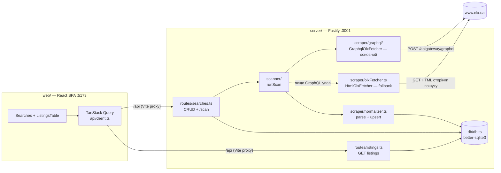

# Архітектура — OLX Dashboard

> Технічний огляд реалізації. Канон вимог і рішень — у [`olx-monitor-spec.md`](./olx-monitor-spec.md).
> Деталі запитів до OLX (URL, параметри, заголовки, селектори) — у [`olx-api.md`](./olx-api.md).
> Дерево файлів і призначення кожного модуля — у [`structure.md`](./structure.md).
> Інваріанти й конвенції, обовʼязкові при змінах, — у [`../CLAUDE.md`](../CLAUDE.md).

## 1. Огляд

Персональна single-user система моніторингу оголошень OLX.ua: збір через GraphQL API OLX
(fallback — HTML) → SQLite → React-таблиця. Локальний запуск, без зовнішніх сервісів
(Notion/cron — пізніші етапи).

Поточний стан: **реалізовано Етап 1 (MVP)**, включно з міграцією збору на GraphQL
(основний метод; HTML — fallback, [`plans/graphql-migration.md`](./plans/graphql-migration.md))
і міграцією фронтенду на Chakra UI v3. Етапи 2–4 — у
[`olx-monitor-spec.md` §12](./olx-monitor-spec.md).

## 2. Стек

| Шар | Технологія |
| --- | --- |
| Monorepo | npm workspaces (`server/` + `web/`) |
| Backend | Node.js 20+, TypeScript (strict), Fastify 5, better-sqlite3 (синхронний), cheerio |
| Frontend | React 18, Vite 6, TanStack Query v5, TanStack Table v8, Chakra UI v3 (+ next-themes) |
| Збір даних | GraphQL `POST /apigateway/graphql` (основний); `fetch` + cheerio HTML-парсинг (fallback). БЕЗ браузера/Playwright |

## 3. Архітектура та потік даних

**Сценарій сканування** (`POST /api/searches/:id/scan` або CLI `npm run scan`):

1. `scanner.runScan(searchId, options?: { deep?: boolean })` читає рядок `searches`,
   парсить `api_filters` (JSON) у `SearchConfig`.
2. Створює запис у `scan_runs` (`started_at`, `kind` = `'deep'` якщо `options.deep`, інакше
   `'normal'`).
3. `GraphqlOlxFetcher.fetchSearch(search, options?)` шле ≤3 POST-запити (offset 0/40/80,
   затримка 1–2 с, заголовки з [`olx-api.md` §2.3](./olx-api.md)) → структуровані
   `RawListing[]` (ціна числом, ISO-дати, `params`) + `exhausted` (остання сторінка `< 40`).
   Якщо GraphQL упав — scanner автоматично повторює скан через `HtmlOlxFetcher`
   (cheerio-парсинг сторінки пошуку, `exhausted` завжди `false`) і фіксує позначку fallback
   у `scan_runs.warning`. При `options.deep` — батчі по 3 запити з паузою 3–6 с,
   ціль `min(26, ceil(visible_total_count/40))` (26 = межа вікна пагінації GraphQL OLX,
   `offset ≤ 1000`; деталі — `olx-api.md` §2.9). Якщо GraphQL вперся у це вікно посеред
   скану (`ListingError` на `offset > 0` з уже зібраними оголошеннями) — скан завершується
   **частковим успіхом** (`exhausted=false`, `warning` записується у `scan_runs.warning`),
   HTML-fallback не запускається. Після кожного запиту/сторінки викликається
   `options.onProgress(done, total)`, який scanner записує у
   `scan_runs.requests_done`/`requests_total`.
4. `normalizer.upsertListings()` використовує структуровані поля (GraphQL) або парсить сирі
   рядки (HTML), робить upsert по `olx_id` у транзакції, рахує `new_count`, оновлює
   `filtered_out` (`localFilters.evaluateFilteredOut`) і — для GraphQL-даних — застосовує
   миттєвий `olx_status`-disable/reactivate.
5. Якщо фетчер був GraphQL (не fallback), скан успішний і **повний** (без warning часткового
   результату — напр. «window cap hit») — `statusEngine.applyScanStatuses(searchId,
   fetched, exhausted, threshold)` застосовує вікно покриття (`miss_count`/disable, §6.1
   [`olx-monitor-spec.md`](./olx-monitor-spec.md)) і повертає `disabled_count`. Вісь вікна —
   `last_refresh_at` (дата підняття; запити збору передають `sort_by=created_at:desc`,
   фактичний порядок видачі — `last_refresh_time DESC` — `olx-api.md` §2.5,
   `docs/plans/coverage-window-fix.md`). **`threshold`** пропорційний надійності скану:
   глибокий → `1`, звичайний → `2` (`scanner/scanFinalize.ts`: `missThreshold`); при disable
   також пишеться `olx_status='inactive'` — щоб колонка «Активність» була чесною
   (`docs/plans/honest-olx-status.md`).
6. `scan_runs` оновлюється (`finished_at`, `found`, `new_count`, `disabled_count`). Розрізнення
   **частковий успіх vs збій**: успішний скан (навіть з застереженням — multi-query/split/
   HTML-fallback) пише застереження у `scan_runs.warning`, а `error` лишає `NULL`; падіння
   **обох** стратегій → `scan_runs.error`, виняток прокидається в роут (HTTP 500), **процес не
   падає**. UI (`ActionPanelLastScan`) показує `error` як червону «Помилку», `warning` — як
   amber «Попередження».
7. Web інвалідовує кеш `listings`/`search-stats` і перемальовує таблицю/панель дій.

> **Синоніми пошукового запиту (`docs/plans/search-synonyms.md`):** якщо `searches.query_synonyms`
> непорожній, `scanner/fetchOrchestrator.fetchAllQueries()` сканує основний `query` + кожен синонім окремо (як
> крок 3, послідовно з паузою 3–6с між варіантами) і зливає видачі по `olxId` в один
> `search_id`. >1 варіант запиту → крок 5 (вікно покриття) **завжди пропускається**
> (`partial=true`) — union кількох незалежних видач не відсортований глобально за
> `last_refresh_at`, той самий принцип, що й у split-скані (deep). Синоніми також передаються
> як alias-назви товару в AI-фільтр релевантності (`relevance.ts`, `getRelevanceAliases`).
> Генерація синонімів — окремі stateless-ендпойнти `routes/searchSynonyms.ts` (промпт/авто
> OpenRouter/парс вставки), UI — `web/src/components/searches/SearchVariantsDialog.tsx`.

> **Verify-сценарій (реалізовано, A3):** `runVerify(searchId)` — окремий `kind='verify'`
> прохід без фетчера видачі. Кандидати (≤`VERIFY_PAGE_CAP=50`): P1 — `last_seen_at` старше
> 3 днів і (`status_source='auto'` АБО `status='rejected'`), включно з `disabled` для
> реактивації, `ORDER BY last_seen_at ASC`; P2 — рядки без `description`, ще не в P1,
> `ORDER BY posted_at DESC`. Для кожного — `probeListingPage(url)` (батч-патерн deep scan:
> 3 запити, пауза 1–2с усередині, 3–6с між батчами). `dead` (`410`/`404`) →
> `status='disabled'` + позначка `auto-disabled: verify http=<код>` у `note` (лише
> auto/rejected, також `olx_status='removed'`); `alive` → `last_seen_at`/`miss_count=0`,
> auto-reactivate `disabled→new` (якщо `status_source='auto'`, також `olx_status='active'`),
> backfill `description`/`seller_name` лише якщо `NULL`; `unknown` → без змін. Прогрес і підсумок — той самий механізм `scan_runs`
> (`requests_done/requests_total`, `found=checked`, `new_count=reactivated`,
> `disabled_count`). Деталі — `docs/plans/verify-pass.md`, маркер — `olx-api.md` §3.4.

> **Двофазний глибокий скан (`docs/plans/two-phase-deep-scan.md`):** окрема дія «Аналіз перед
> сканом» (`POST /scan/analyze`) розділяє те, що раніше робив `fetchSearchSplit` одним
> проходом, на дешеву probe-фазу й окрему дорогу run-фазу. `scanner/analyzeScan.analyzeScan(searchId,
> {deep})` ітерує `dedupeQueries([query, ...querySynonyms])`, для кожного варіанта викликає
> `GraphqlOlxFetcher.analyzeSplit` (root-запит + `probeMaxPrice` + `bisectPriceRange`, **без**
> допагінації бакетів — лише `page0` кожного бакету), агрегує `ScanPlan` (перелік варіантів,
> цінові бакети, `remainingRequests`, ETA, вибіркова оцінка `estimatedNew` через
> `normalizer.selectKnownOlxIds` на `olx_id` з уже завантажених `page0`; **оцінка унікальних**
> `estimatedUnique` через глобальний дедуп вибірок між варіантами — `totalListings × union/sum`
> розмірів `page0`; per-variant `sampleUnique` — внесок синоніма в унікальні; калібрування
> `lastScanRaw`/`lastScanUnique` з останнього завершеного нормального скану `scan_runs`;
> **`unfilteredTotal`** — один додатковий probe головного query БЕЗ фільтра ціни, лише коли
> `apiFilters.ranges.price` активний (звіт показує «N у вашому фільтрі ціни / ~M всього на OLX»,
> щоб відфільтрований підрахунок не плутали з недозбором при порівнянні з сайтом —
> `GraphqlOlxFetcher.probeRootCount`), кешує внутрішній
> `SplitPlan[]` у пам'яті процесу (`Map<planToken, …>`, TTL 30 хв) і повертає лише DTO з
> `planToken` (без важких `page0`). Підтверджений запуск (`POST /scan/run-plan` →
> `runDeepScanFromPlan`) дістає кеш за токеном і для кожного варіанта викликає
> `GraphqlOlxFetcher.scanFromPlan` (допагінація вже відомих бакетів, без повторного
> зондування), далі спільний хвіст `scanFinalize.finalizeScanResult` (upsert, `applyScanStatuses` лише якщо
> `!partial`, оновлення `visible_total_count`). Прострочений/невідомий `planToken` → помилка
> («План застарів — повторіть аналіз»), HTTP 410. Прогони аналітичної фази
> (`scan_runs.kind='analyze'`) виключені із запиту `last_scan` у `/stats`, щоб банер не
> плутав їх зі справжнім скануванням. UI-звіт — `ScanPlanReportDialog.tsx` (сигнатурний
> елемент — «ціновий спектр»: горизонтальна стрічка з шириною сегмента ∝ ширині цінового
> діапазону й інтенсивністю ∝ кількості оголошень).

> **Зупинка скану + прозорість дедупу + історія аналізу (`docs/plans/deep-scan-stop-and-history.md`):**
> `scanner/abortControl.ts` тримає `Map<searchId, boolean>` abort-прапорців; `requestStopScan(searchId)`
> (роут `POST /scan/stop`) ставить прапорець, який фетчери опитують через `FetchOptions.shouldAbort`
> перед кожним запитом/ітерацією (`fetchSearch`, `bisectPriceRange`, `scanBuckets`, HTML-цикл).
> При зупинці зібране все одно йде в `upsertListings`, скан позначається частковим (вікно
> покриття пропускається), `scan_runs.warning='Зупинено користувачем — збережено N'`,
> `ScanResult.stopped=true`. Працює для всіх типів сканів (verify/analyze теж перевіряють прапорець).
> **Прозорість дедупу:** `fetchOrchestrator.fetchAllQueries`/`analyzeScan.runDeepScanFromPlan` рахують `rawCount` (сума листів
> по варіантах до cross-variant дедупу) → `scan_runs.raw_found` + `ScanResult.rawFound`; UI
> показує «сирих / унікальних / злито дублів» (пояснює розрив «4000 в аналізі → 2000 у скані»,
> що виникає бо `analyzeScan` сумує `visible_total_count` синонімів без зняття перетину).
> **Історія аналізу:** `analyzeScan` зберігає повний `ScanPlan` у `scan_runs.scan_plan` (JSON);
> `GET /last-analysis` повертає його + `planValid` (`isPlanCached(planToken)`) — фронт показує
> збережений звіт при повторному заході в «Аналіз перед сканом» із кнопкою «Зробити новий аналіз»
> (`ScanPlanReportDialog`).

## 4. Модулі бекенду

| Модуль | Відповідальність |
| --- | --- |
| `db/db.ts` | Відкриває `server/data/olx.db`, вмикає WAL + foreign_keys, застосовує `schema.sql` при старті, далі `addColumnIfMissing` для дрібних додавань колонок і `migrateListingsTable()` (rebuild `listings` під `PRAGMA user_version=2`: новий CHECK статусів + `miss_count`). Бекфіл `searches.sort_order`. Експортує singleton `db`. |
| `db/schema.sql` | Канонічна схема (5 таблиць: `projects`, `searches`, `listings`, `price_history`, `scan_runs`). Єдине джерело визначень — не дублювати в коді. |
| `types.ts` | Доменні типи (`SearchConfig`, `RawListing`, `ScanResult`, `ListingRow`, `ListingStatus`/`LISTING_STATUSES`, `ListingPatch`, `LocalFilters`, `ParamKeyInfo`, `LastScanInfo`, `SearchStats`, `FetchOptions`, `ScanStatus`, інтерфейс `OlxFetcher`, `PriceBucketSummary`/`ScanPlanQuery`/`ScanPlan` — DTO двофазного deep-скану, `docs/plans/two-phase-deep-scan.md`). Без `any`. |
| `scraper/graphql/` | `GraphqlOlxFetcher implements OlxFetcher` (основний). Модуль розбитий на: `constants.ts` (URL, ліміти, GraphQL query, split-пороги), `types.ts` (типи відповіді GraphQL API, `PriceBucket`, `SplitPlan`), `client.ts` (HTTP запити/парсинг параметрів), `mapper.ts` (конвертація сирих даних у RawListing), `split.ts` (алгоритм розбиття діапазонів і допагінації бакетів), `fetcher.ts` (Facade, який оркеструє client та split), `index.ts` (реекспорт). `fetchPage` — один POST → `{ items, visibleTotalCount, listingError }` (спільна цеглина, тепер у `client.ts`). `fetchSearch` — звичайний/глибокий прохід одного діапазону. Двофазний split (`docs/plans/two-phase-deep-scan.md`): `analyzeSplit(search, options?) → SplitPlan` — лише root-probe + `resolveUpperPriceBound` + `bisectPriceRange`, **без** допагінації (малий пошук/невдалий probe → `SplitPlan.noSplit=true`); `scanFromPlan(search, plan, options?)` — допагінація вже зібраних бакетів (`scanBuckets`) без повторного зондування; `fetchSearchSplit` лишається тонкою композицією `analyzeSplit` + `scanFromPlan` (поведінка швидкого deep-скану незмінна). `probeMaxPrice` — зондування верхньої межі. Запобіжники `MAX_BUCKETS=60`/`MAX_TOTAL_REQUESTS=400` (на варіант; підняті для повного покриття великих пошуків, `docs/plans/deep-scan-stop-and-history.md`); повертає `bucketsUsed`. Деталі — `olx-api.md` §2.9. |
| `scraper/selectors.ts` | Усі OLX-селектори + заголовки HTML-запиту в одному місці (для fallback). |
| `scraper/olxFetcher.ts` | `HtmlOlxFetcher implements OlxFetcher` (fallback №1): побудова URL, fetch, cheerio-парсинг, guard на JS-only сторінку. Той самий `FetchOptions`/глибокий режим (без уточнення цілі за `visible_total_count` — одразу `DEEP_SAFETY_CAP`); `exhausted` завжди `false`. |
| `scraper/dateParser.ts` | `parseOlxDate(raw, now?) → string \| null` — текстові дати HTML-fallback («Сьогодні/Вчора о HH:MM», «D <місяць_родовий> YYYY р.») → ISO (`YYYY-MM-DD[THH:MM:00]`), сумісний з ISO-датами GraphQL для коректного порівняння у `statusEngine.ts`. Нерозпізнане → `null`. |
| `scraper/normalizer.ts` | `upsertListings` (upsert по `olx_id`): пріоритет структурованим полям (GraphQL); для HTML — `parsePrice`, розбір локації/дати + `dateParser.parseOlxDate` для `posted_at` (завжди ISO або `NULL`, ніколи сирий текст). На insert/update — миттєвий `status='disabled'` за `olx_status ≠ 'active'` (для `auto`/`rejected`, з позначкою в `note`) і auto-reactivate; рахує `filtered_out` через `localFilters.evaluateFilteredOut`. `selectKnownOlxIds(olxIds)` — батч `WHERE olx_id IN (...)`, використовується аналітичною фазою deep-скану для оцінки «~нових» у `ScanPlan`. |
| `scraper/statusEngine.ts` | `applyScanStatuses(searchId, fetched, exhausted) → {disabled_count}` (Етап 2, A2) — вікно покриття на осі `last_refresh_at`: `windowFloor = lastRefreshAt` останнього отриманого (`null`, якщо `exhausted`; немає осі → прохід пропускається), відсутні у видачі кандидати в межах вікна дістають `miss_count += 1`, при `>= 2` (auto/rejected) → `disabled` + маркер `auto-disabled: coverage miss_count=2` у `note`. Викликається з `scanner.ts` лише для повних успішних GraphQL-сканів (часткові з warning — ні). |
| `scraper/localFilters.ts` | `evaluateFilteredOut(filters, listing) → boolean` (Етап 2, A4) — ціна/міста/продавці/плюси/мінуси + **категорії** (`category_id ∈ filters.categories`, `docs/plans/category-counts-and-filter.md`), кожна група з режимом invert. Чиста функція, використовується `normalizer.ts` і `routes/searches.ts` (ретроактивний перерахунок). |
| `scraper/olxCategories.ts` | `fetchCategoryOptions(query)` — тягне дерево категорій OLX через facet метаданих пошуку (`/api/v1/offers/metadata/search/?facets=[{field:category,fetchLabel,fetchUrl}]`, верифіковано live, `olx-api.md` §2.11) → `CategoryOption[]` (id + шлях назв root→leaf + OLX-лічильник; ієрархія з url-слагів). Best-effort (помилка/порожньо → null). Викликається `scanner.ts` після скану, результат кешується в `searches.category_facet`. |
| `scraper/verifier.ts` | `probeListingPage(url)` (Етап 2, A3) — пряма проба сторінки оголошення: `fetch` з `redirect:'manual'`; `404`/`410` → `dead`; `200` + `[data-testid="ad_description"]` → `alive` (опис/продавець для backfill); інше → `unknown`. Маркер верифіковано live 2026-06-12 (`olx-api.md` §3.4). |
| `scanner/` | Модулі сканування (розбитий `scanner.ts`): **`abortControl.ts`** — `Map<searchId, boolean>` abort-прапорці, `requestStopScan`; **`searchLoader.ts`** — `loadSearch` (SQLite → `SearchConfig`), `dedupeQueries`; **`fetchOrchestrator.ts`** — `fetchWithFallback` (GraphQL→HTML), `fetchAllQueries` (мульти-query з синонімами + злиття по `olxId`); **`scanRunLifecycle.ts`** — `withScanRun<T>(searchId, kind, body)` — спільний lifecycle `scan_runs` (insert/`onProgress`/error-handling/abort cleanup); **`scanFinalize.ts`** — `finalizeScanResult` (спільний хвіст `runScan` і `runDeepScanFromPlan`: `upsertListings` → `applyScanStatuses` → `refreshCategoryFacet` → `UPDATE scan_runs`); **`runScan.ts`** — `runScan(searchId, {deep?})` — спільна логіка для HTTP-роута і CLI; GraphQL→HTML fallback; `scan_runs.kind` (`normal`/`deep`); **`analyzeScan.ts`** — двофазний deep-скан: `analyzeScan` (probe-фаза, кеш планів TTL 30 хв), `runDeepScanFromPlan` (допагінація за планом), `isPlanCached`/`isAnalysisFresh`; **`verifyScan.ts`** — `runVerify` (P1+P2, проба сторінок, батчі), `countVerifyCandidates`; **`index.ts`** — barrel реекспорт усіх публічних функцій. |
| `routes/searches.ts` | CRUD `/api/searches[/:id]` (PATCH з `local_filters` → ретроактивний перерахунок `filtered_out`; PATCH `archived` → архів/розархів, `plans/archive-searches.md`; PATCH `project_id` → призначення/відв'язування проекту, `plans/projects.md`) + `POST /:id/move` (сусід серед `archived = 0` ТА того ж `project_id`) + `POST /:id/scan` (`?deep=true`) + `POST /:id/scan/analyze` + `POST /:id/scan/run-plan` + `POST /:id/scan/stop` (зупинка, `docs/plans/deep-scan-stop-and-history.md`) + `GET /:id/scan-status` + `GET /:id/last-analysis` + `GET /:id/param-keys` + `GET /:id/filter-options` + `GET /:id/stats`. |
| `routes/projects.ts` | CRUD `/api/projects[/:id]` (групування пошуків в акордеони, `docs/plans/projects.md`): `GET` (сорт `sort_order ASC`), `POST` (нова згори), `PATCH` (перейменування), `DELETE` (відв'язує пошуки `project_id=NULL`, НЕ видаляє), `POST /:id/move` (реордер сусідом). |
| `routes/listings.ts` | `GET /api/searches/:id/listings` з білим списком колонок для сортування + `PATCH /api/listings/:id` (`{status?, note?, pros?, cons?, ai_relevant?, olx_status?}`, валідація `LISTING_STATUSES`, зміна статусу → `status_source='manual'`, `miss_count=0`; `ai_relevant` → `ai_relevant_source='manual'`, ручний override семантичного фільтра; `olx_status` (`active`/`inactive`/`removed`/`null`) — ручна «Активність», разова підказка без source-захисту). |
| `analysis/*` | **LLM-аналіз** (план `plans/llm-analysis.md`, доповнено `plans/analysis-wizard-review-rework.md`): `constants.ts` (ЄДИНЕ джерело magic-значень: модель, `AUTO_CHUNK_SIZE=12`, `MANUAL_ZIP_CHUNK_SIZE=50`, `MAX_ANALYZE_IDS=200`, мапи режиму, scaffold, повідомлення про помилки, `MIME_ZIP`), `config.ts` (лише завантаження `server/.env` через `process.loadEnvFile` + `hasApiKey`/`getApiKey`), `prompts.ts` (єдине джерело промптів `buildCriteriaPrompt`/`buildMatchingPrompt`/`pickSample`/`buildManualZipInstructions`/`buildChunkListings`/`PATTERNS_EXAMPLE_JSON` для авто Й ручного), `analyze.py` (готовий детермінований Python-движок для ZIP-пакета: regex-матчинг критеріїв з клауза-скоуп запереченнями, морфологічними стемами, дослівним evidence; читається з диску як `schema.sql` і кладеться в ZIP), `openrouter.ts` (`chat()` — POST `/chat/completions`, `response_format:json_object`, ретрай, зняття code-fence), `parse.ts` (парс відповідей критеріїв/matching + верифікація `evidence` як підрядок опису + мерж кількох вставок), `text.ts` (`stripHtml`/`normalizeForMatch`/`evidenceConfirmed`). PII продавця в промпт не йде; `evidence` у БД не зберігається. |
| `export/xlsx.ts` | `buildXlsxBuffer(sheet, columns, rows)` на **ExcelJS** — спільний Excel-експорт (превʼю аналізу + майбутній експорт усієї таблиці): заголовки/ширини, заморожений рядок заголовків, перенос тексту. |
| `routes/analysis/*` | Ендпойнти LLM-аналізу (нижче §6), розбиті по файлах: `index.ts` (реєстрація + `GET /api/analysis/status`), `criteria.ts` (генерація/імпорт критеріїв), `matching.ts` (`analyze`/`package.zip`/`import`/`export`), `commit.ts` (запис у БД). Критерії читаються/пишуться у `searches.analysis_criteria`; commit пише `pros`/`cons` + `analysis_at/source/model`, `analysis_stale=0`. |
| `analysis/aiPicks.ts` + `routes/aiPicks.ts` | **AI Вибір** (план `plans/AI-auto-top.md`) — окрема від matching фіча ранжування: кандидати без мінусів/не відфільтровані/активні/релевантні (`ai_relevant IS NOT 0` — як вкладка «Найкращі кандидати»), сортовані за ціною, до `PICK_CANDIDATES_LIMIT=500` (`repo.ts: loadPickCandidates`) йдуть у промпт; LLM обирає й сортує фінальний ТОП-`PICK_TOP_N=30`. `buildPickPrompt`/`parsePickResponse`/`runAiPicks` — спільні для авто (OpenRouter) й ручного режиму. Ручний режим: один промпт (`GET /ai-picks/prompt`) для пулів ≤`MANUAL_PICKS_ZIP_CHUNK_SIZE=50`; для більших — ZIP-пакет (`GET /ai-picks/package.zip`, `prompt.txt` + `candidates/chunk-NNN.json` по 50). На відміну від matching тут немає детермінованого скрипта (ранжування вимагає LLM-судження, не літерального матчингу) — `buildPickManualZipInstructions` замість цього кладе в `prompt.txt` 2-етапні map-reduce інструкції: етап 1 — LLM номінує до `PICKS_NOMINEES_PER_CHUNK=10` кращих із кожного чанку; етап 2 — фінальний ТОП-30 серед усіх номінантів; усе виконується всередині одної агент/чат-сесії, у застосунок вставляється рівно ОДНА фінальна JSON-відповідь (без нової UI-логіки накопичення). `POST /ai-picks/commit` пише `ai_rank`/`ai_pick_reason`/`ai_ranked_at`, скидаючи попередні результати пошуку. |
| `analysis/relevance.ts` + `routes/relevance.ts` | **Семантичний фільтр релевантності** (план `plans/semantic-relevance-filter.md`) — окрема від matching/AI Вибору фіча: для кожного оголошення класифікує «чи цей лот ПРОДАЄ цільовий товар» (а не аксесуар/запчастину/згадку сумісності). Цільовий товар — на рівні пошуку (`searches.relevance_target`, порожній → `query`, `repo.ts: getRelevanceTarget`/`setRelevanceTarget`). `buildRelevancePrompt`/`buildRelevanceZipInstructions`/`parseRelevanceResponse`/`runRelevance` — спільні для авто (OpenRouter, чанки по `AUTO_CHUNK_SIZE=12`) й ручного режиму (ZIP `prompt.txt` + `descriptions/chunk-NNN.json` по `MANUAL_ZIP_CHUNK_SIZE=50`, без `analyze.py` — класифікація семантична, не літеральний матчинг). **Евристичний пре-фільтр перед ШІ** (`prefilterCandidates`): для цілей формату «бренд + номер моделі» відсіює оголошення, де бренд і номер моделі НЕ стоять поруч (`RELEVANCE_PROXIMITY_WINDOW=4` слів) — напр. «iPhone 1**5**», «батарея **5**%» для цілі «iphone 5»; до ШІ йдуть лише кандидати, відсіяні одразу `relevant=false` (reason «Авто-відсіяно…»). Обережний: ціль без номера моделі/бренду або «відкинуло б усе» → пропускає всіх до ШІ. Застосовується в `runRelevance` (авто), `package.zip` (у ZIP лише кандидати) і `relevance/import` (інжектує відсіяних за scope `ids`). `POST /relevance/preview` віддає розбивку (total/candidates/autoRejected) для UI. **Ручний ZIP** для агентного CLI (Antigravity, слабкі моделі типу Gemini Flash): крім `prompt.txt` + чанків кладе готові `relevance_merge.py`/`relevance_verify.py` (у ZIP — `merge.py`/`verify.py`); інструкція — жорстка покрокова процедура (класифікуй чанк → `classifications/result-NNN.json` → `merge.py` → `verify.py`), що обходить ліміт довжини відповіді й забороняє вигадувати власні скрипти. `POST /relevance/import` мерж відповіді в накопичене за `id`. `POST /relevance/commit` пише `ai_relevant`/`ai_relevant_reason`/`ai_relevant_at`/`ai_relevant_source`; рядки з `ai_relevant_source='manual'` НЕ перетираються (умова в `UPDATE`). PII продавця в промпт не йде. |
| `index.ts` | Fastify bootstrap, CORS для `:5173`, `/health`, реєстрація `searchesRoutes`/`projectsRoutes`/`listingsRoutes`/`analysisRoutes`/`aiPicksRoutes`/`relevanceRoutes`, слухає `:3001`. |
| `scan.ts` | CLI-обгортка над `runScan` (`npm run scan -- --search <id>`). |
| `migratePostedAt.ts` | Одноразова CLI-міграція (`npm run migrate:posted-at`): конвертує наявні текстові `posted_at` (старий HTML-fallback) через `dateParser.parseOlxDate` в ISO; нерозпізнане → `NULL`. Виводить кількість конвертованих/занулених. |

## 5. Схема БД

Канон — [`server/src/db/schema.sql`](../server/src/db/schema.sql) (детальний опис полів у
[`olx-monitor-spec.md` §5](./olx-monitor-spec.md)). Таблиці: `projects`, `searches`, `listings`,
`price_history`, `scan_runs`.

Ключові інваріанти (повний перелік — у [`../CLAUDE.md`](../CLAUDE.md)):
- `listings.olx_id` UNIQUE — ключ дедуплікації (upsert).
- `status` ∈ `new|interested|contacted|rejected|disabled`; `status_source` ∈ `auto|manual`;
  `miss_count` — лічильник сканів поспіль без оголошення у вікні покриття.
- `params` зберігається сирим JSON.
- `filtered_out` — прапорець локальних фільтрів (`local_filters`), рядок не видаляється.
- `searches.project_id` — FK на `projects.id` (NULL = «Без проекту»); видалення проекту відв'язує
  пошуки (`project_id=NULL`), не видаляє їх (`docs/plans/projects.md`).
- `searches.sort_order` — ручний порядок у списку (менше → вище); бекфіл існуючих рядків
  (`0..N-1` за `created_at DESC`) виконує `db.ts` при старті, нові пошуки отримують
  `MIN(sort_order) - 1` (з'являються згори).

> `price_history` створена у схемі, але кодом ще не наповнюється (Етап 3).

- LLM-аналіз (план `plans/llm-analysis.md`): `searches.analysis_criteria` (JSON `{cons:[],
  pros:[]}` — обрані критерії пошуку); `listings.pros`/`cons` (масив criterion, TEXT
  `• …\n• …`), `analysis_at`/`analysis_source` (`api`|`import`)/`analysis_model`/
  `analysis_stale`. Нові колонки додаються через `addColumnIfMissing` **після**
  `migrateListingsTable()` (rebuild не переносить їх → інакше крах на старій v1-БД).
  `evidence` у БД не зберігається. `normalizer` ставить `analysis_stale=1`, якщо
  `analysis_at` непорожній і title/опис змінились (бейдж «застарілий аналіз»).

## 6. REST API

| Метод | Шлях | Стан |
| --- | --- | --- |
| `GET/POST/PATCH/DELETE` | `/api/searches[/:id]` | ✅ Етап 1/2 — `GET` сортує за `sort_order ASC, created_at DESC, id DESC`; `DELETE` каскадний (`price_history` → `scan_runs` → `listings` → `searches`, у транзакції); `PATCH` з `local_filters` (Етап 2) → зберігає + синхронно перераховує `filtered_out` для всіх рядків пошуку, повертає `filtered_out_count` |
| `POST` | `/api/searches/:id/move` | ✅ — `{direction: 'up'\|'down'}`, міняє `sort_order` із сусідом (серед `archived=0` ТА того ж `project_id`, для кнопок ↑/↓ у sidebar) |
| `GET/POST/PATCH/DELETE` | `/api/projects[/:id]` | ✅ Проекти (`docs/plans/projects.md`) — групування пошуків в акордеони; `GET` сорт `sort_order ASC, created_at DESC, id DESC`; `POST {name}` (нова згори); `PATCH {name}` (перейменування); `DELETE` відв'язує пошуки (`project_id=NULL`), пошуки НЕ видаляє |
| `POST` | `/api/projects/:id/move` | ✅ — `{direction: 'up'\|'down'}`, реордер проектів сусідом (кнопки ↑/↓ у заголовку акордеону) |
| `POST` | `/api/searches/:id/scan?deep=true` | ✅ Етап 1/2 — повертає `{found, new_count, rawFound?, requestsUsed, disabled_count, stopped?}`; `deep=true` — глибокий скан (§2.9 `olx-api.md`); `rawFound` — сирих до дедупу між синонімами (`rawFound-found`=злито дублів); `disabled_count` — результат `statusEngine` (Етап 2, лише GraphQL-скани) |
| `POST` | `/api/searches/:id/scan/analyze?deep=true` | ✅ — двофазний deep-скан (`docs/plans/two-phase-deep-scan.md`): лише probe-фаза (root + цінові бакети, без допагінації), повертає `ScanPlan` (розбивка по синонімах, ETA, `estimatedNew`); план кешується сервером (TTL 30 хв) під `planToken` + зберігається у `scan_runs.scan_plan` (історія) |
| `POST` | `/api/searches/:id/scan/run-plan` | ✅ — body `{planToken}`, перевикористовує кешований план (без повторного зондування) → повертає `ScanResult` як звичайний deep-скан; прострочений/невідомий токен → 410 |
| `POST` | `/api/searches/:id/scan/stop` | ✅ — зупинка активного скану (`docs/plans/deep-scan-stop-and-history.md`): ставить abort-прапорець, скан завершується частковим успіхом і зберігає вже зібране; повертає `{stopped}` |
| `POST` | `/api/searches/:id/verify` | ✅ Етап 2 (A3) — verify-прохід (кандидати P1+P2, ≤50 сторінок); повертає `VerifyResult {checked, alive, dead, unknown, reactivated, disabled_count, backfilled}` |
| `GET` | `/api/searches/:id/scan-status` | ✅ Етап 1/2 — останній рядок `scan_runs` (для поллінгу прогресу глибокого скану/verify) |
| `GET` | `/api/searches/:id/last-analysis` | ✅ — останній збережений `ScanPlan` (`kind='analyze'`): `{plan, analyzedAt, planValid}`; `planValid=false` → план протермінований (лише перегляд); 404, якщо аналізів не було |
| `GET` | `/api/searches/:id/listings?sort=&order=` | ✅ Етап 1 |
| `GET` | `/api/searches/:id/param-keys` | ✅ Етап 2 — `{key, samples}[]` для конструктора діапазонів локальних фільтрів (UI закомментовано, заплановано на майбутнє) |
| `GET` | `/api/searches/:id/filter-options` | ✅ Етап 2 — `{cities, sellers, pros, cons, categories}` для Drawer'а локальних фільтрів; `categories` — кешований facet OLX (`searches.category_facet`: назви+ієрархія+OLX-лічильники, без мережі в запиті); локальні лічильники накладає фронт у пам'яті |
| `GET` | `/api/searches/:id/stats` | ✅ Етап 2 — `{in_db, stale_count, verify_candidates, last_scan}` для панелі дій пошуку (`verify_candidates` = P1+P2, лічильник кнопки «Перевірити неактивні») |
| `PATCH` | `/api/listings/:id` | ✅ Етап 2 — `{status?, note?, pros?, cons?, ai_relevant?, olx_status?}`; зміна `status` → `status_source='manual'`, `miss_count=0`; `ai_relevant` → `ai_relevant_source='manual'` (ручний override семантичного фільтра); `olx_status` (`active`/`inactive`/`removed`/`null`) — ручна «Активність» (разова підказка, без source-захисту) |
| `GET` | `/api/analysis/status` | ✅ LLM-аналіз — `{apiAvailable, defaultModel}` (наявність `OPENROUTER_API_KEY`) |
| `GET/PUT` | `/api/searches/:id/criteria` | ✅ — читання/збереження `searches.analysis_criteria` (`{cons[], pros[]}`) |
| `POST` | `/api/searches/:id/criteria/generate` | ✅ — авто-генерація критеріїв (OpenRouter), без ключа → 409 |
| `GET` | `/api/searches/:id/criteria/prompt?mode=` | ✅ — готовий промпт генерації (ручний режим) |
| `POST` | `/api/searches/:id/criteria/import` | ✅ — парс вставленої відповіді LLM у список критеріїв |
| `POST` | `/api/searches/:id/analyze` | ✅ — авто matching (чанки по 12), верифікація `evidence`; `{results, errors}`, НЕ пише в БД |
| `GET` | `/api/searches/:id/analyze/package.zip?mode=&ids=` | ✅ — ZIP-пакет ручного режиму: `prompt.txt` (інструкція з 2 варіантами) + `analyze.py` (готовий детермінований движок) + `patterns.example.json` (приклад мапи) + `descriptions/chunk-NNN.json` (по 50 оголошень) |
| `POST` | `/api/searches/:id/analyze/import` | ✅ — парс однієї вставленої відповіді + верифікація + мерж у накопичене |
| `POST` | `/api/searches/:id/analyze/export` | ✅ — експорт превʼю (`xlsx` через ExcelJS \| `json`) |
| `POST` | `/api/listings/analyze/commit` | ✅ — запис `pros`/`cons` + `analysis_*` (chunked з боку клієнта); `merge='append'` (дефолт UI — додати до наявних без дублів) \| `'replace'` (перезаписати) |
| `GET` | `/api/searches/:id/ai-picks/prompt` | ✅ — готовий промпт ручного режиму (один файл, пули ≤50 кандидатів) |
| `GET` | `/api/searches/:id/ai-picks/package.zip` | ✅ — ZIP-пакет ручного режиму для пулів >50: `prompt.txt` (2-етапні map-reduce інструкції) + `candidates/chunk-NNN.json` (по 50) |
| `POST` | `/api/searches/:id/ai-picks/rank` | ✅ — авто-режим (OpenRouter) → `PickResult {picks, summary}`, НЕ пише в БД; 409 без `OPENROUTER_API_KEY` |
| `POST` | `/api/searches/:id/ai-picks/import` | ✅ — парс вставленої відповіді ручного режиму → `PickResult`, НЕ пише в БД |
| `POST` | `/api/searches/:id/ai-picks/commit` | ✅ — запис `ai_rank`/`ai_pick_reason`/`ai_ranked_at`; скидає попередні результати пошуку перед записом нових |
| `GET/PUT` | `/api/searches/:id/relevance/target` | ✅ Семантичний фільтр — читання/збереження `searches.relevance_target` (порожній → `query` як передзаповнення) |
| `POST` | `/api/searches/:id/relevance/preview` | ✅ — розбивка пре-фільтра для UI: `{total, candidates, autoRejected}` (скільки піде в ШІ vs авто-відсіється), НЕ пише в БД |
| `POST` | `/api/searches/:id/relevance/analyze` | ✅ — авто-класифікація «лот продає <товар>?» (пре-фільтр + чанки по 12), `{results, errors}`, НЕ пише в БД; без ключа → 409 |
| `POST` | `/api/searches/:id/relevance/package.zip` | ✅ — ZIP ручного режиму: `prompt.txt` + готові `merge.py`/`verify.py` + `descriptions/chunk-NNN.json` (лише кандидати по 50). Покрокова процедура для агентного CLI (Antigravity): класифікуй чанк → `classifications/result-NNN.json` → `merge.py` → `verify.py` |
| `POST` | `/api/searches/:id/relevance/import` | ✅ — парс вставленої відповіді + інжект авто-відсіяних (пре-фільтр за scope `ids`) + мерж у накопичене за `id` |
| `POST` | `/api/searches/:id/relevance/commit` | ✅ — запис `ai_relevant`/`ai_relevant_*`; рядки з `ai_relevant_source='manual'` НЕ перетираються |
| `GET` | `/health` | ✅ |
| `GET` | `/api/listings/:id/price-history` | ⏳ Етап 3 |
| `GET` | `/api/listings/:id/export/markdown` | ⏳ Етап 3 |
| `POST` | `/api/searches/:id/export/notion` | ⏳ Етап 4 |

## 7. Frontend

- `api/client.ts` — fetch-обгортка + TanStack Query хуки: `useSearches`, `useCreateSearch`,
  `useDeleteSearch`, `useReorderSearches`, `useScan`, `useVerify`, `useScanStatus`,
  `useSearchStats`, `useListings`, `useUpdateListing`, `useParamKeys`, `useUpdateSearchFilters`.
  LLM-аналіз: `useAnalysisStatus`, `useSavedCriteria`, `useGenerateCriteria`,
  `useImportCriteria`, `useSaveCriteria`, `useAnalyze` (клієнтське чанкування по 200),
  `useImportAnalysis`, `useCommitAnalysis` (chunked) + плоскі хелпери `fetchCriteriaPrompt`/
  `fetchAnalyzePackageZip`/`exportPreview` (GET/blob за кнопкою). Всі типи DTO імпортуються з `types/index.ts`. Форма пошуку маппить «ціна від/до» у
  `api_filters.ranges.price`. `useScan` приймає `{searchId, deep?}` і має
  `mutationKey: ['scan']` (щоб `useAutoRefresh` міг перевірити `queryClient.isMutating`),
  інвалідовує `['listings', searchId]` і `['search-stats', searchId]`; `useVerify` (Етап 2,
  A3) — `POST /api/searches/:id/verify` (`mutationKey: ['verify']`), та сама інвалідація;
  `useScanStatus(searchId, enabled)` поллить `GET .../scan-status` раз на ~1.5с, поки
  `enabled`; `useSearchStats(searchId)` тягне `GET /api/searches/:id/stats` для панелі дій.
  `useAnalyzeScan()` (двофазний deep-скан, `docs/plans/two-phase-deep-scan.md`) — `POST
  /scan/analyze?deep=true` → `ScanPlan`; `useRunScanPlan()` — `POST /scan/run-plan` з
  `{planToken}`, та сама інвалідація, що й `useScan`. `useUpdateListing()` —
  `PATCH /api/listings/:id` (`{status?, note?}`) з оптимістичним апдейтом кешу
  `['listings', searchId]`. `useFilterOptions(searchId, enabled)` — `GET .../filter-options`
  (`{cities, sellers}` для дропдаунів Drawer'а, увімкнено лише коли відкрито
  `SearchFiltersDrawer`). `useParamKeys` — закомментовано (заплановано на майбутнє разом з
  UI діапазонів params).
  `useUpdateSearchFilters()` — `PATCH /api/searches/:id` з `local_filters`, інвалідовує
  `['searches']` і `['listings', searchId]`, повертає `filtered_out_count`. `useDeleteSearch`
  інвалідовує `['searches']` і прибирає кеш `['listings', id]`; `useReorderSearches` шле
  `POST /api/searches/:id/move` і інвалідовує `['searches']`.
- `types/index.ts` — централізований файл з усіма фронтенд-типами: `Listing` (включно з
  `status`, `status_source`, `note`, `filtered_out`, `miss_count`, `olx_status`),
  `ListingStatus`/`LISTING_STATUSES`, `ListingPatch`, `LocalFilters` (`price_range`, `cities`,
  `sellers`; старі `exclude_keywords`/`ranges` закомментовано), `ParamKeyInfo`, `FilterOptions`,
  `LastScanInfo`, `SearchStats`, `Search` (включно з `sort_order`, `visible_total_count`,
  `local_filters`), `NewSearchInput`, `StoredTableState` тощо — дзеркало відповідних типів
  `server/src/types.ts`.
- `stores/settingsStore.ts` — глобальний Zustand-стор (`useSettingsStore`) з `persist` middleware: зберігає налаштування інтерфейсу (`columnVisibility`, `columnOrder`, `descriptionExpandEnabled`, `searchesVisible`), налаштування автооновлення (`autoRefreshEnabled`, `autoRefreshIntervalMin`), параметри AI (`analysisModel`, `analysisReasoning`, `analysisExtraCriteria`) у `localStorage`. Також містить ефемерний стан вибраного пошуку (`selectedSearchId`) та виділених рядків таблиці (`rowSelection`).
- `utils/storage.ts` — хелпери для `localStorage` виключно для специфічного стану таблиці `TABLE_STORAGE_KEY` (сортування, розміри колонок).
- `utils/format.ts` — хелпери форматування ціни (`formatPrice`), форматування дати
  (`formatDate`), відносного часу (`formatRelativeTime`, напр. «3 год тому» — для рядка
  стану панелі дій) та чистки HTML-опису (`stripDescriptionHtml`).
- `utils/status.ts` — `STATUS_LABELS`/`STATUS_COLORS` (Record по `ListingStatus`: `new` blue,
  `interested` green, `contacted` purple, `rejected` gray, `disabled` red) та
  `isMutedStatus(status)` (`disabled`/`rejected` → приглушений рядок).
- `stores/listingsUiStore.ts` — Zustand-стор `useListingsUiStore`: `statusFilter: ListingStatus | 'all' | 'ai_picks'`
  (дефолт `'all'`), `showFilteredOut`, `showIrrelevant` + сетери. Спільний in-memory стан фільтрів
  списку, що читається і в `ListingsTable` (видимі рядки), і в `ListingsFilterBar` (`SegmentGroup` +
  перемикачі шуму), і в `useAnalysisScope` (обсяг AI-аналізу). Жодного persist (in-memory).
- `utils/listingVisibility.ts` — ЄДИНЕ джерело правди видимості рядка: `passesNoiseFilters` (перемикачі
  відфільтрованих/нерелевантних), `isAiPickCandidate` (предикат вкладки «Найкращі кандидати»),
  `isListingVisible` (вкладка + шум). Цим самим предикатом керується і таблиця, і лічильники вкладок,
  і scope майстра — тому «число в дужках вкладки» завжди = «скільки піде в AI-аналіз».
- `stores/analysisWizardStore.ts` — Zustand-стор `useAnalysisWizardStore`: прогрес AI-Flow
  (`mode`, `scope: 'selected'|'all'|'tab'`, `step`, `available`, `selected: Set<string>`,
  `customInput`, `accumulated`, `includedOverrides: Map<string,boolean>`), `boundSearchId`,
  `criteriaLoadedMode`. Дії: `bindSearch(id)` — скидає лише якщо змінився пошук;
  `reset()` — повне скидання. In-memory (не persisted): переживає закриття/відкриття
  модалки, але скидається при refresh сторінки.
- `hooks/useListingsTableState.ts` — кастомний React-хук для збереження та завантаження стану сортування, розмірів колонок та пагінації (`pageSize` персиститься, `pageIndex` — ні) таблиці.
- `hooks/useAutoRefresh.ts` — `useAutoRefresh(enabled, intervalMin)`: поки увімкнено і вкладка
  видима, раз на `intervalMin` хвилин послідовно запускає `useScan({deep:false})` для всіх
  пошуків (пауза 5–10с між ними), пропускаючи тік якщо вже триває скан
  (`queryClient.isMutating({mutationKey:['scan']})`). Toast на старті і підсумковий
  (`+N нових` або тихий «новин немає»). Глибокий скан/verify не запускає.
- `hooks/useIsMobile.ts` — `useIsMobile()`: `useBreakpointValue({ base: true, md: false }) ??
  false` — єдине джерело "мобільний/desktop" для умовного рендеру (size/layout
  branching), напр. у `Searches.tsx` та `AnalysisWizardDialog.tsx`. Breakpoint —
  Chakra default `md` (768px).
- `components/table/` — ізольовані компоненти таблиці оголошень:
  - `HeaderLabel.tsx` — заголовок колонки з відповідною Lucide-іконкою.
  - `columns.tsx` — визначення колонок для TanStack Table (включно з display-колонкою
    `select` для bulk-дій, 36px, `enableSorting/enableResizing/enableHiding: false`) та
    список `TOGGLEABLE_COLUMNS` (без `select`).
  - `ListingsTableHeader.tsx` — заголовок таблиці `<thead>` із підтримкою сортування та
    ресайзу колонок (`columnResizeMode: 'onEnd'`); ресайз-хендл рендериться лише якщо
    `header.column.getCanResize()`.
  - `ListingsTableBody.tsx` — тіло таблиці `<tbody>`, яке рендерить рядки.
  - `ListingsTableRow.tsx` — рядок таблиці, обгорнутий у `React.memo` (економія ререндерів
    на вибір рядка/typing/пагінацію). **Увага:** TanStack Table НЕ перестворює об'єкт `row`
    при зміні порядку чи видимості колонок, тож `arePropsEqual` ОБОВ'ЯЗКОВО має містити
    `columnLayoutKey` (підпис `table.getVisibleLeafColumns()`, прокидається з
    `ListingsTable.tsx` через `ListingsTableBody`). Без нього memo пропускає ререндер і тіло
    розсинхронізовується із заголовком при reorder/toggle колонок (доводиться робити
    refresh). Рядки `status='disabled'`/`'rejected'` — приглушені (`isMutedStatus`).
  - `StatusCell.tsx` — компактний `NativeSelect` зі статусом у вигляді кольорового
    бейджа (`STATUS_COLORS`); зміна → `useUpdateListing()` (`status_source='manual'`,
    `miss_count=0`).
  - `NoteCell.tsx` — обрізаний текст нотатки (`lineClamp 2`); клік відкриває
    `Popover.Root`/`Portal` з `Textarea` + кнопкою «Зберегти» (PATCH `note`). Portal —
    рендериться в `document.body`, не обмежений `overflow:auto` контейнером таблиці.
  - `ProsConsCell.tsx` — комірки для колонок «Плюси» та «Мінуси», поведінка аналогічна
    до `NoteCell.tsx`, але з відповідними іконками та кольорами. Колонки сортовані за
    кількістю пунктів (`countProsConsItems` з `utils/format.ts`, один непорожній рядок =
    один пункт) із `sortDescFirst: true` — перший клік ставить угору оголошення з
    найбільшою кількістю плюсів/мінусів.
  - `HighlightText.tsx` — підсвічує всі збіги пошукового запиту в тексті через
    `<Mark bg="yellow.subtle">`; використовується в колонках «Назва»/«Опис» і в
    `DescriptionTooltip`.
  - `ListingsFilterBar.tsx` — панель над таблицею: `SegmentGroup` фільтра статусів (Всі +
    `LISTING_STATUSES`, з лічильниками з урахуванням toggle filtered_out) — читає/пише
    `statusFilter` через `useListingsUiStore` напряму (не через props); `Switch`
    «Показати відфільтровані», `Input` текстового пошуку із кнопкою очищення.
  - `BulkActionBar.tsx` — з'являється, коли є вибрані рядки: «Вибрано: N» + `Menu` зі
    статусами (`LISTING_STATUSES`/`STATUS_LABELS` з відповідними іконками) → `Promise.allSettled` з
    `useUpdateListing().mutateAsync()` по кожному `id` (підсумковий toast), і «Скасувати»
    (`setRowSelection({})`).
  - `DescriptionTooltip.tsx` — інтерактивний тултіп з прокруткою для попереднього перегляду тексту опису. Клік по вмісту відкриває `DescriptionDialog`.
  - `TablePagination.tsx` — панель пагінації під таблицею: `Pagination.Root` (Chakra UI v3) з номерами сторінок, prev/next, текстом «N–M з T» та селектором розміру сторінки (25/50/100/200). Прихована, якщо рядків ≤ 25.
- `App.tsx` — компоновка сторінки (Header, Searches sidebar, ListingsTable). Керує станом видимості бічної панелі (`searchesVisible`). `selectedId` може стати `null` (видалення активного пошуку) — тоді `ListingsTable` показує заглушку «Обери пошук зліва». `useAutoRefresh(autoRefreshEnabled, autoRefreshIntervalMin)` викликається тут.
- `components/Header.tsx` — шапка сайту («OLX Dashboard» + бейдж «авто: N хв» (`LuTimer`), кнопка згортання/розгортання бічної панелі, інформація про активний обраний пошук з підсвіткою, `SearchActionPanel` (кнопка виклику модального вікна) та `SettingsDrawer`). Responsive: зовнішній `HStack` з `wrap="wrap" rowGap={2}` (права група кнопок переноситься на новий рядок на вузьких екранах); текст «OLX Dashboard» прихований на `base` (іконка лишається); бейдж вибраного пошуку — `ml={{ base: 0, md: '80px' }}` з `lineClamp={1}`/`maxW={{ base: '40vw' }}`.
- `components/DescriptionDialog.tsx` — модальне вікно повного опису оголошення (`DialogRoot
  size="lg" placement="center" scrollBehavior="inside"`): фото/назва/ціна/місто в хедері,
  повний текст опису (скрол) у тілі, «Відкрити на OLX» + «Закрити» у футері. Відкривається
  кліком по комірці «Опис» (`ListingsTable.tsx` тримає `descriptionListing` стан).
- `components/SearchActionPanel.tsx` — модальне вікно дій вибраного пошуку (`DialogRoot`),
  що викликається кнопкою "Сканувати" з `Header.tsx`. Містить рядок стану з `useSearchStats()`
  (статистика бази, останній скан), прогрес-бар поточного скану та три кнопки дій:
  «Швидкий скан» / «Глибокий скан» / «Перевірити неактивні (N)». Глибокий скан відкриває
  додатковий `ConfirmActionDialog`. Усі кнопки блокуються під час активного скану.
- `components/ConfirmActionDialog.tsx` — спільний діалог підтвердження довгої дії
  (`DialogRoot role="alertdialog"`, патерн діалогу видалення пошуку): title/description/
  confirmLabel + `Checkbox` «Більше не питати» (`onConfirm(skipNextTime)`). Використовується
  для глибокого скану в `SearchActionPanel`; для verify — заплановано (A3).
- `components/searches/` — бічна панель (sidebar), розбита на дрібні компоненти (рефакторинг,
  раніше — один файл `Searches.tsx`):
  - `Searches.tsx` — точка входу: на мобільному (`useIsMobile()`) вміст (`SearchesPanel`)
    рендериться всередині overlay `DrawerRoot placement="start" size="xs"` (керується пропом
    `visible`/`onVisibleChange` з `App.tsx`); на desktop — постійна панель `w="80"`. Тримає
    `useNewSearchForm()` і рендерить його `SearchVariantsDialog` окремо від акордеону (Dialog
    через Portal, незалежно від Drawer/aside-обгортки).
  - `SearchesPanel.tsx` — `Accordion.Root`: секції-проекти (`ProjectAccordionItem` на кожен
    проект із `useProjects()`) + «Без проекту»/«Архів» (`SearchGroupAccordionItem`, спільний) +
    кнопки «Новий проект» (`LuFolderPlus` → `ProjectCreateDialog`) і «Новий пошук». Активні пошуки
    групуються за `project_id`; усі секції розкриті за замовчуванням (`docs/plans/projects.md`).
  - `SearchGroupAccordionItem.tsx` — список `SearchRow` з `isFirst`/`isLast` за індексом
    (стрілки реордеру `LuChevronUp`/`LuChevronDown`, `useReorderSearches`, disabled на краях —
    лише для активних, архівні їх не показують).
  - `ProjectAccordionItem.tsx` — секція-акордеон одного проекту: заголовок із меню проекту
    (`LuEllipsisVertical` → «Перейменувати»/«Видалити», `ProjectEditDialog`/`ProjectDeleteDialog`)
    і стрілками реордеру проекту (`useReorderProjects`) ПОЗА тригером (тригер — `<button>`),
    усередині — список `SearchRow` цього проекту.
  - `ProjectCreateDialog.tsx`/`ProjectEditDialog.tsx`/`ProjectDeleteDialog.tsx` — діалоги
    створення/перейменування (поле «Назва») та підтвердження видалення (пошуки переходять у
    «Без проекту», не видаляються).
  - `NewSearchForm.tsx` — презентаційна форма створення пошуку; увесь стан і `submit` —
    у хуку `hooks/useNewSearchForm.ts`.
  - `SearchRow.tsx` — назва/запит/ціна, бейдж синонімів (тултіп зі списком), крапка-індикатор
    активних `local_filters`; мутації архівування/видалення/реордеру — хук
    `hooks/useSearchRowActions.ts`.
  - `SearchRowMenu.tsx` — 3-dot меню (`Menu.Root`, іконка `LuEllipsisVertical`) — «Редагувати»/
    «Фільтри» (`LuFilter`, відкриває `SearchFiltersDrawer`)/«Варіанти пошуку»/«Перемістити в
    проект» (вкладене підменю `Menu.TriggerItem` зі списком проектів + «Без проекту»,
    `useAssignSearchToProject`)/«Архівувати»/«Видалити» (`LuTrash2`, `color="fg.error"`).
  - `SearchDeleteDialog.tsx` — `DialogRoot role="alertdialog"` підтвердження видалення (каскадно
    через `useDeleteSearch`; якщо видалено активний пошук — `onSelect(null)`).
  - `SearchFiltersDrawer.tsx` — Drawer редактора `local_filters`: діапазон цін (`Input` мін/макс),
    місто і продавець — `NativeSelect` (варіанти з `useFilterOptions`) + `Tag.Root` chips з
    видаленням. «Зберегти» → `useUpdateSearchFilters()` → toast з `filtered_out_count`.
    Стоп-слова й діапазони params — закомментовано, заплановано на майбутнє.
  - `SearchVariantsDialog.tsx`, `SearchEditDialog.tsx` — без змін логіки, лише перенесені сюди.
  - Спільні парсери `searches.local_filters`/`query_synonyms` винесено в
    `utils/localFilters.ts` (`parseLocalFilters`/`hasActiveLocalFilters`) і
    `utils/searchSynonyms.ts` (`parseSearchSynonyms`) — раніше дублювались у кількох файлах.
- `pages/ListingsTable.tsx` — відображення списку оголошень: збирає разом
  `useListingsTableState`, колонки, `ListingsFilterBar` (фільтр статусу з `useListingsUiStore` +
  toggle filtered_out + текстовий пошук → `globalFilter`/`globalFilterFn` по title+description),
  `BulkActionBar` (за наявності `rowSelection`), `ListingsTableHeader`/`ListingsTableBody`/
  `TablePagination`/`DescriptionDialog`. `rowSelection` (`getRowId: row => String(row.id)`,
  `enableRowSelection: true`) скидається при зміні `searchId`. Клієнтська пагінація через
  `getPaginationRowModel()` (TanStack Table v8) тримає DOM обмеженим розміром сторінки навіть
  для ~2000 оголошень (фікс зависання UI після глибокого скану — `docs/plans/listings-pagination.md`).
  Експортує `TOGGLEABLE_COLUMNS` для збереження зворотньої сумісності з `SettingsDrawer`.
- `components/settings/SettingsDrawer.tsx` — Drawer «Налаштування» (іконка-шестерня в шапці, `App.tsx`), що єднає три підкомпоненти з `web/src/components/settings/sections/`:
  - `VisualSection.tsx` — розділ «Візуальний вигляд»: перемикач теми light/dark (`useColorMode` з `@chakra-ui/react`), перемикач «Розширений перегляд опису (тултіп + модалка)» (`descriptionExpandEnabled`);
  - `AutoRefreshSection.tsx` — розділ «Автооновлення»: `Switch` автооновлення + `NativeSelect` вибору інтервалу (15/30/60 хв);
  - `ColumnsSection.tsx` — розділ «Колонки таблиці»: підтримка drag-and-drop перевпорядкування колонок (на базі `@dnd-kit`) та чекбокси видимості колонок таблиці (`TOGGLEABLE_COLUMNS`).
  Усі налаштування персистяться в `localStorage` (за допомогою хелперів із `web/src/utils/storage.ts`).
- `theme/` — **система стилів** (єдина точка керування візуалом). `palette.ts` тримає
  `ACCENT_BASE` (базова Chakra-палітра акценту), `FEEDBACK_BASE` (success/warning/danger/info →
  green/orange/red/accent), `THEME_PALETTES` (ім'я→база, з якого генеруються токени) і
  `STATUS_PALETTE`. `tokens.ts` через `defineConfig` будує для кожної кастомної палітри
  (`accent`, `success`, `warning`, `danger`, `info`) числову шкалу (`<name>.50…950`) і семантичні
  аліаси (`<name>.solid`/`fg`/`subtle`/…) на її базу, тож `colorPalette="warning"` і прямі
  відтінки `warning.500` поводяться як базова палітра, але керуються з одного рядка.
  `system.ts` (`createSystem(defaultConfig, customConfig)`) підключається у `ui/provider.tsx`
  замість `defaultSystem`. `layout.ts` — стильові константи розмірів/відступів
  (`SIDEBAR_WIDTH`, `CONTENT_PAD_*`, `EMPTY_STATE_PAD`, `DIALOG_SIZE`, `DRAWER_SIZE`).
  Семантика замість буквальних кольорів: акцент → `accent` (не `"blue"`), попередження →
  `warning` (не `"orange"`), помилка/мінуси → `danger` (не `"red"`), успіх/плюси → `success`
  (не `"green"`); доменні `purple`/`cyan`/`teal`/`gray`/`yellow` лишаються як є.
  `utils/status.ts` бере `STATUS_COLORS` з `theme/palette` (interested→success, disabled→danger).
  План — `plans/theme-and-constants-refactor.md`.
- `components/ui/` — Chakra UI v3 snippets, здебільшого додані через
  `npx @chakra-ui/cli snippet add` (`provider`, `color-mode`, `toaster`, `tooltip`, `drawer`,
  `switch`, `checkbox`, `close-button`); `dialog.tsx` написаний вручну за тим самим патерном
  (`DialogRoot`/`DialogContent`/`DialogHeader`/`DialogBody`/`DialogFooter`/`DialogCloseTrigger`/
  `DialogBackdrop`) — використовується `DescriptionDialog`, `ConfirmActionDialog` і діалогом
  підтвердження видалення.
- `components/analysis/` — майстер LLM-аналізу: `AnalysisWizardDialog.tsx` (`DialogRoot
  size={isMobile ? 'full' : 'xl'}`, `closeOnInteractOutside={false}` — прогрес не втрачається
  при кліку повз вікно; X і Esc лишаються); степер Критерії→Пошук→Перевірка→Вставка.
  **Тільки на кроці 1** — перемикачі Мінуси/Плюси та scope (Вибрані / [Назва вкладки] /
  Весь пошук); кнопка «Назва вкладки (N)» видима лише коли `statusFilter !== 'all'` (стор
  `listingsUiStore`); кроки 2–4 — read-only рядок «{режим} · {scope} (N)» у хедері.
  **Прогрес Flow в Zustand** (`analysisWizardStore`): `bindSearch(id)` скидає лише при зміні
  пошуку, закриття без commit зберігає крок/критерії/результати; після commit (крок 4) та
  «Почати заново» — `reset()`. Scope «tab» → `effectiveIds` = оголошення з поточним
  статусом вкладки (fallback на весь пошук якщо `statusFilter === 'all'`).
  Крок 2 (ручний режим) — кнопка «Завантажити ZIP-пакет»
  (`fetchAnalyzePackageZip`, `prompt.txt` + `analyze.py` + `patterns.example.json` +
  `descriptions/chunk-NNN.json`), `ManualAssistant`
  без `parts` (`emptyHint` з підказкою прогнати ZIP через агента/чат і вставити єдиний JSON); крок 3 —
  спільні рендер-фрагменти рядка (`renderPhotoTitle`/`renderDescriptionBlock`/
  `renderCriteriaTags`, без дублювання логіки toggle/evidence) рендеряться або в
  desktop-таблиці (Chakra `Table.Root`, `tableLayout: 'fixed'`, скрол `maxH="50vh"`), або —
  на мобільному — як стек карток (`Stack maxH="60vh" overflowY="auto"`, кожна картка `Box
  p={3} borderWidth="1px" rounded="md"` зі вмістом фото+назва → опис → теги): фото+назва |
  опис (`DescriptionTooltip`+`DescriptionDialog`, підсвітка `HighlightText` за evidence
  включених критеріїв, `lineClamp` 3 на desktop / 4 на мобільному) | теги критеріїв (клік —
  toggle include/exclude через
  `includedOverrides`, hover — tooltip з `evidence`, закреслення для виключених,
  пунктирна рамка для `!ok`); рядки без результатів (`items.length === 0`) приховані
  (лічильник «Показано N із M»); експорт Excel/JSON враховує toggle-стан; крок 4 — commit
  chunked (лише включені критерії) + `ConfirmActionDialog` при перезаписі непорожніх
  `pros`/`cons`) і `ManualAssistant.tsx` (панель ручного режиму: копіювати/завантажити
  промпт(и) + вставити відповідь, опціональний `emptyHint`). Кнопка «AI» (`LuSparkles`) —
  у `Header`; `rowSelection` піднято в `App.tsx` (передається в `ListingsTable` і як
  `selectedIds` у майстер).
- `components/settings/sections/AnalysisSection.tsx` — секція «AI-аналіз»: статус ключа
  (`useAnalysisStatus`), поле «Модель», `Switch` «reasoning», `Textarea` «Додаткові критерії»;
  персист у `SETTINGS_STORAGE_KEY` (`analysisModel`/`analysisReasoning`/`analysisExtraCriteria`).
- `components/table/ProsConsCell.tsx` — додано бейдж `LuTriangleAlert` (tooltip) при
  `analysis_stale=1` та tooltip «Аналіз: <model|ручний імпорт>, <дата>» при `analysis_at`.
- Vite proxy `/api → http://localhost:3001` (див. `web/vite.config.ts`).

## 8. Обробка помилок збору

- Ланцюжок стратегій: **GraphQL → HTML (автоматично в scanner) → `__NEXT_DATA__` →
  headed Playwright** (останні два не реалізовані — рішення людини).
- GraphQL-помилки (HTTP ≠ 200, `errors[]`, `ListingError`) → виняток → scanner пробує
  `HtmlOlxFetcher`; при успіху fallback скан вважається успішним, а в `scan_runs.warning`
  пишеться позначка `graphql failed: ...; fallback html OK`.
- Падіння обох стратегій не валить процес: повна помилка у `scan_runs.error` (поле `warning`
  лишається `NULL`), скан failed, попередні дані лишаються.
- Частковий успіх GraphQL (вікно пагінації `offset≤1000` вичерпано посеред скану,
  `docs/plans/graphql-offset-window.md`) — скан вважається успішним, зібрані дані
  зберігаються, `warning` (`graphql window cap hit at offset=<N>`) пишеться у
  `scan_runs.warning`.
- **Розрізнення `error` vs `warning`:** `scan_runs.error` — ТІЛЬКИ реальний збій (обидві
  стратегії впали); частковий успіх (multi-query синоніми, price-split, HTML-fallback, window
  cap) → `scan_runs.warning`. UI показує перше червоним («Помилка»), друге — amber
  («Попередження»). Старі рядки до міграції можуть мати warning-текст у `error` — виправиться
  наступним сканом.
- Якщо HTML-сторінка не дала карток і немає `empty-state` — `HtmlOlxFetcher` **кидає виняток із
  зразком HTML** і ознакою наявності `__NEXT_DATA__`, а не переходить на браузер автоматично.
- Діагностика поломок — чекліст [`olx-api.md` §5](./olx-api.md).

## 9. Відомі відхилення від початкового канону

- 2026-06-10: заголовок HTML-картки OLX мігрував з `h6` на `h4` — селектор розширено до
  `h6, h4` (`server/src/scraper/selectors.ts`). Решта селекторів підтверджені робочими.
- 2026-06-10: канон змінено — основним методом збору став GraphQL (раніше: static HTML;
  заборону `api/v1/offers` знято після підтвердження живим тестом). Деталі —
  [`olx-api.md`](./olx-api.md), план — [`plans/graphql-migration.md`](./plans/graphql-migration.md).
