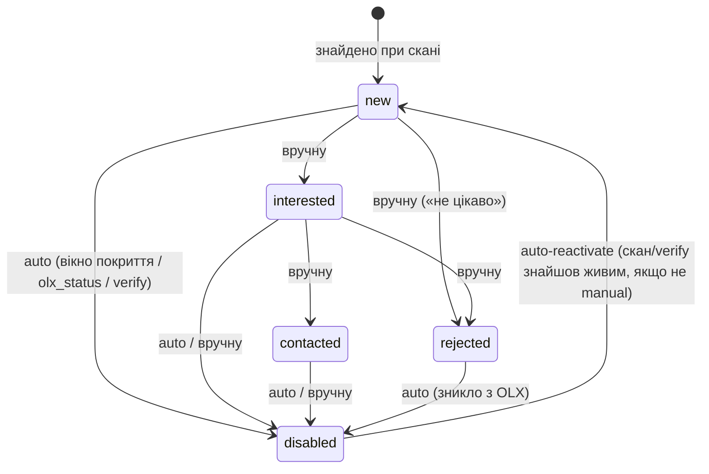

# Бізнес-правила — OLX Dashboard

> Детальна механіка доменної логіки: скани, статуси, auto-disable/verify, фільтри.
> Короткі інваріанти, які агент мусить бачити завжди, — у [`../AGENTS.md`](../AGENTS.md);
> запити до OLX (URL, параметри, селектори) — у [`olx-api.md`](./olx-api.md);
> AI-кроки — у [`ai-flow.md`](./ai-flow.md). Зміна будь-якого правила тут — лише після
> підтвердження людиною.

## 1. Схема БД і ключі

Канонічна схема — у `server/src/db/schema.sql`. Таблиці: `projects`, `searches`, `listings`, `price_history`, `scan_runs`, `app_logs`. Не дублювати визначення в коді — читати/застосовувати з SQL-файлу при старті.

Ключові інваріанти:
- `listings.olx_id` UNIQUE — ключ дедуплікації (upsert по ньому).
- `status` ∈ `new|interested|contacted|rejected|disabled` (CHECK у схемі); `rejected` — лише ручний статус («не цікаво»).
- `status_source` ∈ `auto|manual`.
- `miss_count` — лічильник послідовних сканів без цього оголошення у вікні покриття (механіка — нижче).
- `params` — сирий JSON (характеристики різняться між категоріями; колонки UI динамічні).

## 2. Скани

- **Звичайний скан:** ≤3 запити, 1–2 с між запитами/сторінками (ввічливість); GraphQL; HTML-fallback
  вимкнено (`olx-api.md` §3) — збій GraphQL = помилка скану. Спільна логіка роуту й CLI — `server/src/scanner/`.
- **Глибокий скан** (ручна кнопка «Глибокий скан» в UI поруч зі «Сканувати», або CLI `--deep`) —
  одноразовий поглиблений прохід для нарощування покриття БД: батчі по 3 запити (як звичайний
  скан), пауза **3–6 с** між батчами, ціль `min(26, ceil(visible_total_count / 40))` запитів
  (`26` = `MAX_PAGES` — межа вікна пагінації GraphQL OLX, `offset ≤ 1000`, верифіковано
  2026-06-12; `50` лишається стартовою оцінкою `DEEP_SAFETY_CAP` до 1-го запиту, але кап
  завжди `26`). Рання зупинка, якщо сторінка повернула `< 40`/порожньо — як і в звичайному
  скані. Якщо GraphQL впирається у вікно пагінації посеред скану (`ListingError` на
  `offset > 0` з уже зібраними даними) — скан завершується частковим успіхом
  (`exhausted=false`, `warning` у `scan_runs.error`), HTML-fallback не запускається.
  Прогрес (`requests_done`/`requests_total` у `scan_runs`) пишеться через
  `FetchOptions.onProgress` і віддається `GET /api/searches/:id/scan-status` для
  поллінгу фронтендом. Деталі — `docs/olx-api.md` §2.9.
- **Авто-розбиття по ціні (всередині глибокого скану):** якщо `visible_total_count > 1000`
  (вікно пагінації), глибокий скан автоматично ділить ціновий діапазон адаптивною бісекцією
  на під-діапазони ≤ вікна, сканує кожен і зливає через дедуп `olx_id`. Верхня межа без явної
  `to` — `probeMaxPrice` (зондування ціною спадно, **самоперевіряється**: сортування за ціною
  в OLX GraphQL не верифіковане live; якщо не спрацювало — звичайний deep + попередження).
  Запобіжники: `MAX_BUCKETS=60`, `MAX_TOTAL_REQUESTS=400` (на варіант query; підняті з 40/200
  для повного покриття дуже великих пошуків, `docs/plans/old/deep-scan-stop-and-history.md`),
  паузи 3–6с між батчами/бакетами. Якщо ліміт усе одно впирається — `scanFromPlan` ставить
  `warning` (capHit), скан `partial`. **Вікно покриття для split-скану НЕ запускається** (union
  кількох діапазонів не відсортований глобально за refresh — `warning` робить скан `partial`).
  Реалізація — `server/src/scraper/graphql/split.ts` (`fetchSearchSplit`/`probeMaxPrice`), `client.ts` (`fetchPage`);
  план/деталі — `docs/plans/old/price-range-split.md`, `docs/olx-api.md` §2.9.
- **Двофазний глибокий скан — аналіз → звіт → підтверджений запуск (`docs/plans/old/two-phase-deep-scan.md`):**
  окрема кнопка «Аналіз перед сканом» у UI (поруч зі «Глибокий скан», який лишається незмінним —
  одноразовий безперервний прохід) запускає лише легку probe-фазу: `GraphqlOlxFetcher.analyzeSplit`
  (root-запит + `probeMaxPrice` + бісекція на бакети) по основному `query` й кожному синоніму,
  **без допагінації бакетів**. Результат — `ScanPlan` (DTO `server/src/types.ts`/`web/src/types/index.ts`):
  розбивка по варіантах запиту, цінові бакети, ETA (`remainingRequests * DEEP_SCAN_SECONDS_PER_REQUEST`),
  оцінка `estimatedNew` (вибіркова, з уже завантажених `page0`, проти БД через `selectKnownOlxIds`).
  План кешується сервером у пам'яті (`Map<planToken, …>`, TTL 30 хв — `PLAN_TTL_MIN`/`SCAN_PLAN_TTL_MIN`,
  `server/src/scanner/analyzeScan.ts`) і повертається фронту лише як токен — підтверджений запуск зі звіту
  (`POST /scan/run-plan` → `runDeepScanFromPlan`) **перевикористовує** вже зібрані межі
  бакетів/`page0` через `GraphqlOlxFetcher.scanFromPlan`, без повторного зондування.
  **Валідність звіту для UI — часова, не прив'язана до in-memory кешу** (`isAnalysisFresh` за
  `scan_runs.finished_at`): звіт лишається запускним протягом TTL навіть після закриття діалогу
  чи перезапуску сервера. Якщо швидкий план із кешу зник (TTL-edge/рестарт/повторний запуск), а
  аналіз ще свіжий — `runDeepScanFromPlan` робить повний глибокий скан із повторним зондуванням
  (`runScan deep`) замість помилки; зрозуміла помилка («План застарів — повторіть аналіз», без
  500) лишається лише для справді протермінованого (> TTL) аналізу. Аналітичні прогони
  (`scan_runs.kind='analyze'`) виключені з банера `last_scan`. Реалізація —
  `server/src/scraper/graphql/fetcher.ts` (`analyzeSplit`/`scanFromPlan`), `server/src/scanner/analyzeScan.ts`
  (`analyzeScan`/`runDeepScanFromPlan`),
  `web/src/components/searches/action-panel/ScanPlanReportDialog.tsx` (звіт, сигнатурний елемент —
  «ціновий спектр»).
- **Зупинка скану + прозорість дедупу + історія аналізу (`docs/plans/old/deep-scan-stop-and-history.md`):**
  кнопка «Зупинити» у `ScanProgressPanel` (для всіх сканів) → `POST /scan/stop` →
  `scanner.requestStopScan` ставить abort-прапорець (`Map<searchId>`), який фетчери опитують через
  `FetchOptions.shouldAbort` перед кожним запитом. Зібране **все одно зберігається** (`upsert`),
  скан стає `partial` (вікно покриття пропускається), `scan_runs.warning='Зупинено…'`,
  `ScanResult.stopped=true`. **Прозорість дедупу:** `scan_runs.raw_found` (сирих до cross-variant
  дедупу) + `ScanResult.rawFound`; UI показує «сирих / унікальних / злито дублів» — пояснює розрив
  «N в аналізі → менше у скані» (аналіз сумує `visible_total_count` синонімів без зняття перетину).
  **Історія:** `analyzeScan` зберігає повний `ScanPlan` у `scan_runs.scan_plan`; `GET /last-analysis`
  (+`planValid` через `isPlanCached`) → фронт показує останній звіт при повторному заході в «Аналіз
  перед сканом» із кнопкою «Зробити новий аналіз».
- **Довгий скан на free-тарифі Render (`docs/plans/old/scan-keepalive.md`):** скан іде всередині одного
  HTTP-запиту, а free-інстанс засинає після 15 хв без вхідних запитів (поллінг фронту стає на паузу
  у фоновій вкладці). Тому, поки триває хоча б один скан, сервер раз на 5 хв сам звертається до
  свого публічного `/health` (`RENDER_EXTERNAL_URL`; локально й у CLI — вимкнено) — вкладку можна
  закривати. **Обірвані скани** (процес зупинився посеред скану — засинання/рестарт/деплой) на
  старті сервера закриваються: `finished_at` + `error` «Скан перервано…» (warn у журнал); зібране до
  обриву вже в БД (інкрементальне збереження). CLI на старті скани не закриває.

### Синоніми пошукового запиту (мульти-query скан)

- **Синоніми пошукового запиту (план `docs/plans/old/search-synonyms.md`):** на OLX той самий товар
  часто шукають за різними словами («біговел»/«велобіг»). Один «Пошук» може мати список
  синонімів `query` (`searches.query_synonyms`, JSON-масив), редагованих у модалі «Варіанти
  пошуку» (відкривається з форми створення пошуку й з 3-dot меню існуючого). Інваріанти:
  - **Скан — автоматично**, без окремої кнопки: `scanner.fetchAllQueries()` сканує основний
    `query` + кожен синонім окремо (пауза 3–6с між варіантами, як батчі deep-скану), зливає
    видачі по `olx_id` в один `search_id` (upsert уже дедуплікує глобально).
  - **Вікно покриття (auto-disable) ЗАВЖДИ пропускається**, якщо синонімів >0 (`partial=true`,
    як split-скан) — union кількох незалежних видач не відсортований глобально за
    `last_refresh_at`, тож вісь вікна невалідна. Живість таких оголошень перевіряє verify-прохід.
  - **Синоніми = alias-назви товару для AI-фільтра релевантності** (`getRelevanceAliases`) —
    лот, що продає товар під будь-яким із синонімів, теж релевантний; пре-фільтр бренд+модель
    рахує union токенів target+aliases (лише розширює коло кандидатів, ніколи не звужує).
  - **Генерація** — окремі stateless-ендпойнти `POST /api/search-synonyms/prompt|generate|import`
    (не прив'язані до `searchId` — працюють ще до збереження пошуку), той самий патерн
    авто+ручний (ManualAssistant), що й критерії LLM-аналізу.
  - Реалізація — `server/src/scanner/fetchOrchestrator.ts` (`fetchAllQueries`), `server/src/routes/searchSynonyms.ts`,
    `server/src/analysis/{prompts,parse,relevance,repo}.ts`, фронт —
    `web/src/components/searches/SearchVariantsDialog.tsx`.

## 3. Статуси: upsert, auto-disable, verify, override

- **Upsert:** новий `olx_id` → insert (`status='new'`, окрім миттєвого `olx_status`-disable нижче). Існуючий → update полів + `last_seen_at`. ⏳ **Етап 3:** якщо ціна змінилась — рядок у `price_history` (таблиця є в схемі, але кодом ще НЕ наповнюється — `server/src/scraper/normalizer.ts`).
- **Auto-disable — вікно покриття (coverage window):** працює на осі **`last_refresh_at`** (дата підняття; НЕ `posted_at` — «підняті» старі оголошення йдуть угорі видачі й розтягнули б вікно на роки: інцидент 2026-06-12, 395 хибних disable, `docs/plans/old/coverage-window-fix.md`). Усі GraphQL-запити збору передають `sort_by=created_at:desc` (фактичний порядок видачі — `last_refresh_time DESC`, промо поза порядком; `docs/olx-api.md` §2.5). Після **повного** успішного **GraphQL**-скану (HTML-fallback і часткові скани з warning — напр. «window cap hit» — цю логіку НЕ запускають) — `windowFloor = lastRefreshAt` ОСТАННЬОГО отриманого оголошення (низ останньої сторінки; не `min()` — промо розтягнули б вікно), або `NULL`, якщо видача вичерпана (`exhausted`) — тоді вікно = вся видача; немає осі (порожня видача) → прохід пропускається. Кандидати на `miss_count += 1` — рядки цього `search_id` зі `status != 'disabled'`, відсутні в цьому скані, з `last_refresh_at >= windowFloor` (рядки з `last_refresh_at IS NULL` — «хвіст»/старі — не кандидати ніколи, їх перевіряє verify); присутнім — `miss_count = 0`. При `miss_count >= threshold` і (`status_source='auto'` АБО `status='rejected'`) → `status='disabled'`, `olx_status='inactive'` (щоб колонка «Активність» була чесною — інакше лишалося б застигле `'active'`) + позначка `auto-disabled: coverage miss_count=<threshold>` у `note` (кожен auto-disable має пояснення причини в нотатці). **`threshold` залежить від глибини скану:** глибокий скан бачить усю видачу → `1` (1 промах = достатній доказ смерті); звичайний (≤3 запити, лише верхівка) → `2` (буфер проти дрижання видачі); `server/src/scanner/runScan.ts` передає `options.deep ? 1 : 2`. Реалізація — `server/src/scraper/statusEngine.ts`, викликається з `server/src/scanner/scanFinalize.ts`.
- **`olx_status` миттєвий auto-disable:** якщо GraphQL повернув `olx_status ≠ 'active'` для рядка зі `status_source='auto'` АБО `status='rejected'` → миттєво `status='disabled'`, у `note` додається позначка `auto-disabled: olx_status=<значення>` (маркер для ручної перевірки тепер задокументований у `docs/olx-api.md` §3.4 — такі рядки потрапляють у verify-прохід і підтверджуються/спростовуються прямою пробою сторінки).
- **Verify-прохід (реалізовано, A3):** ручний прохід (кнопка «Перевірити неактивні» / CLI `--verify`) по кандидатах ≤50 сторінок за прохід — P1 (давно не бачені: `last_seen_at` старше 3 днів і (`status_source='auto'` АБО `status='rejected'`), включно з `status='disabled'` для реактивації, `ORDER BY last_seen_at ASC`) + P2 (рядки без `description`, ще не в P1, `ORDER BY posted_at DESC`); той самий батч-патерн, що й глибокий скан. Маркер неактивності (верифіковано live 2026-06-12, `docs/olx-api.md` §3.4): HTTP `410`/`404` → `dead` (auto/rejected → `disabled`, `olx_status='removed'` — підтверджено пробою, позначка `auto-disabled: verify http=<код>` у `note`); `200` + `[data-testid="ad_description"]` → `alive` (оновлює `last_seen_at`/`miss_count=0`, auto-reactivate `disabled→new` з `olx_status='active'`, дозаповнює `description`/`seller_name` лише якщо в БД `NULL`); інше → `unknown` (без змін). Реалізація — `server/src/scraper/verifier.ts` (`probeListingPage`) + `runVerify` у `server/src/scanner/verifyScan.ts`. ⚠️ З 2026-10-03 OLX відповідає `403` на сторінки оголошень → кожна проба `unknown`, прохід нічого не змінює (S15, [P-005](parking.md)).
- **Ручний override:** будь-яка ручна зміна статусу (`PATCH /api/listings/:id`) → `status_source='manual'`, `miss_count=0`. Якщо `status_source='manual'` — auto-логіка (вікно покриття, `olx_status`, verify) НЕ перетирає статус, окрім переходу `rejected → disabled` (зникнення з OLX — факт сильніший за ручну оцінку).
- **Ручний override «Активності» (`olx_status`):** `PATCH /api/listings/:id` приймає `olx_status` (`active`/`inactive`/`removed`/`null`) — інлайн-select «Активність» у таблиці. **Разова підказка БЕЗ захисту** (на відміну від `status`/`ai_relevant`): окремої колонки-джерела немає, тож наступний GraphQL-скан/verify, що побачить оголошення, перепише значення реальним від OLX (для `NULL`-рядків поза видачею ручне значення зберігається — скан їх не торкається). `docs/plans/old/honest-olx-status.md`.
- **Auto-reactivate:** auto-disabled оголошення знову з'явилося в GraphQL-видачі з `olx_status='active'` (або verify підтвердив живе) → назад у `new`, `miss_count=0`. Manual-disabled НЕ реактивується автоматично.
- **filtered_out:** `local_filters` (ціна, міста, продавці, плюси, мінуси, категорії; кожна група може бути інвертована — чорний список; групи комбінуються через AND; стоп-слова й діапазони по `params` — ⏳ закладено в типах, не реалізовано) ставлять прапорець, НЕ видаляють рядок. Зміна `local_filters` (`PATCH /api/searches/:id`) → синхронний ретроактивний перерахунок `filtered_out` для всіх рядків пошуку; записуються лише рядки, де значення змінилось (`server/src/scraper/refilter.ts`).
- **Notion-синк:** one-way (app → Notion), match по `olx_id`. Двосторонній — поза скоупом.
