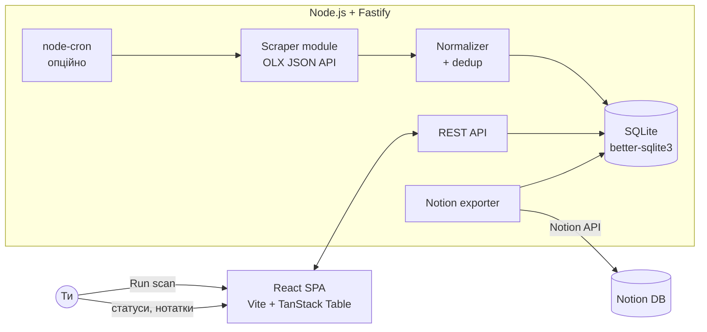
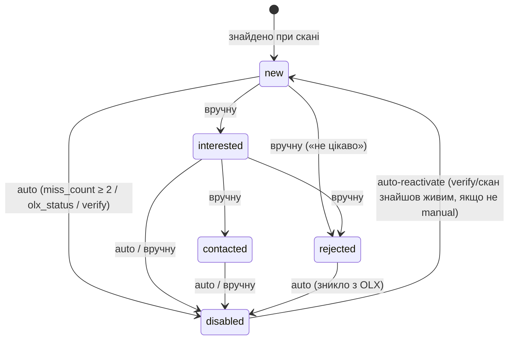

# OLX Dashboard — Архітектура та специфікація

> Персональна система моніторингу оголошень OLX.ua: напівавтоматичний збір, таблиця порівняння, статуси, нотатки, історія цін, експорт у Notion.

---

## 1. Загальна концепція

**Гібридний підхід (варіант C):** готова техніка скрейпінгу (прихований JSON API OLX, як у `darkov19/olx-telegram-bot`) + власний бекенд/БД/фронтенд під твій стек (Node.js + React).

**Чому не форк готового проекту цілком:** жоден проект зі звіту не має UI з таблицею, статусами та нотатками. Найближчі (`Parser-of-olx`, `lerdem/olx-parser`) — Python без фронтенду. Дешевше взяти лише їхній підхід до збору даних.

**Масштаб:** 1–5 активних пошуків, 10–100 оголошень на пошук → SQLite достатньо, PostgreSQL не потрібен.

---

## 2. Архітектура



**Потік даних:**
1. Ти створюєш Search (запит + фільтри-діапазони) в UI.
2. Кнопка **Scan** (або cron) → бекенд тягне OLX JSON API посторінково.
3. Normalizer: upsert за `olx_id`, фіксація зміни ціни в `price_history`, оновлення `last_seen_at`.
4. Оголошення, що зникли з видачі → автоматично `disabled`.
5. UI показує таблицю: сортування/фільтри по характеристиках, інлайн-редагування статусу й нотаток.
6. Кнопка **Export to Notion** → створення/синхронізація Notion database.

---

## 3. Технологічний стек

| Шар | Вибір | Чому |
| --- | --- | --- |
| Backend | Node.js 20+, Fastify | Твій основний стек; Fastify легший за Express, вбудована схема-валідація |
| БД | SQLite (`better-sqlite3`) | Локально, 0 конфігурації, синхронний API, файл легко бекапити |
| Збір даних | GraphQL `POST /apigateway/graphql` (основний); `fetch` + `cheerio` static HTML (fallback) | GraphQL верифіковано живим тестом 2026-06-10 (без кукі/auth); HTML підтверджено кодом lerdem; без Playwright; легко на Orange Pi |
| Frontend | React 18 + Vite + TanStack Table + Tailwind | TanStack Table = сортування/фільтри/інлайн-едіт з коробки |
| Стан | TanStack Query | Кеш + рефетч після сканування |
| Планувальник | `node-cron` (опційно, off за замовчуванням) | "Перш за все вручну" |
| Notion | `@notionhq/client` | Офіційний SDK; internal integration token |

---

## 4. Збір даних (Scraper module)

> ✅ Обидва методи підтверджені: GraphQL — живим тестом 2026-06-10 (повний дамп + мінімальний
> запит без кукі), HTML — аналізом робочого коду `lerdem/olx-parser` (UA, Python) та
> `l-margiela/olx-mcp` (UA, TS) і власним сканом.

### 4.1 Основний шлях — GraphQL API

Фронтенд OLX тягне видачу через `POST https://www.olx.ua/apigateway/graphql`
(query `ListingSearchQuery` → `clientCompatibleListings(searchParameters)`).
Підтверджено: працює **без кукі, без Authorization, без токенів**; range-фільтри
(`{key: "filter_float_price:from", value: "8000"}`) працюють; пагінація `offset`/`limit`.

Переваги над HTML: ціна числом + валюта, дати в ISO (`created_time` → сортовний `posted_at`),
`params` (характеристики) і `description` вже у списковій видачі, ознака `business`,
жодних CSS-селекторів (нема класу поломок «OLX поміняв розмітку»).

**Усі деталі запиту/відповіді, таблиця ключів `searchParameters`, маппінг полів у БД —
[`olx-api.md`](./olx-api.md) §2 (канон для реалізації).** Реалізація:
`server/src/scraper/graphqlOlxFetcher.ts`.

Існує також REST-дзеркало `https://www.olx.ua/api/v1/offers?offset=&limit=&query=...`
(видно в `links` GraphQL-відповіді) — підтверджено для olx.ua; використовуємо GraphQL-варіант.

### 4.1-bis Fallback №1 — static HTML fetch + parse

`lerdem/olx-parser` тягне дані звичайним `requests.get()` (UA реального браузера) і парсить **server-rendered HTML** через lxml — без браузера, без JS-рендерингу. Це підтверджує: проста GET-сторінка пошуку вже містить картки оголошень. Найлегший варіант, добре йде на Orange Pi. Scanner вмикає цей шлях автоматично, якщо GraphQL-запит упав.

```
GET https://www.olx.ua/d/uk/list/q-macbook-air/
  ?currency=UAH
  &search[order]=created_at:desc
  &search[filter_float_price:from]=15000
  &search[filter_float_price:to]=35000
  &search[private_business]=private        // опційно: тільки приватні
  &view=list
```

Заголовки (з робочого коду lerdem):
```
User-Agent: Mozilla/5.0 (Windows NT 10.0; rv:91.0) Gecko/20100101 Firefox/91.0
Referer: <той самий url>
X-Client: DESKTOP
```

**Парсинг (cheerio), селектори підтверджені в обох проектах:**

| Поле | Селектор |
| --- | --- |
| Картка | `[data-cy="l-card"]` |
| Назва | `[data-cy="l-card"] h6` (або `h4`) |
| Ціна | `[data-testid="ad-price"]` (напр. `"6 000 грн."` → нормалізувати) |
| Лінк | `[data-cy="l-card"] a[href]` (відносний → префікс `https://www.olx.ua`) |
| Дата/локація | `[data-testid="location-date"]` |
| Порожня видача | `[data-cy="empty-state"]` |
| Характеристики (detail) | `[data-cy="ad-params"] li` |
| Опис (detail) | `[data-testid="ad_description"]` |
| Тип продавця | `[data-testid="trader-title"]` (бізнес) |
| Фото CDN | `ireland.apollo.olxcdn.com/v1/files/{id}/image;s=WxH` |

**Правила ввічливості:**
- Звичайний скан: затримка 1–2 с між сторінками, ≤3 сторінки на пошук.
- Глибокий скан (ручна кнопка/CLI `--deep`, `?deep=true`): батчі по 3 запити
  (`BATCH_SIZE`) з паузою 3–6 с між батчами, ціль `min(50, ceil(visible_total_count/40))`
  запитів, рання зупинка при сторінці `<40` елементів. Прогрес пишеться у
  `scan_runs.requests_done`/`requests_total` і віддається через
  `GET /api/searches/:id/scan-status` (деталі — `olx-api.md` §2.9).

Scraper — окремий модуль за інтерфейсом, щоб міняти стратегію без зачіпання решти:

```ts
interface OlxFetcher {
  fetchSearch(search: SearchConfig): Promise<RawListing[]>;       // список
  fetchDetail?(url: string): Promise<RawListingDetail>;           // опц.: характеристики
}
```

### 4.2 Подальші fallback (якщо і GraphQL, і static HTML віддають порожнечу)

1. Перевірити `__PRERENDERED_STATE__` / `__NEXT_DATA__` у `<script>` сторінки (JSON всередині, без рендерингу JS).
2. Крайній випадок — Playwright з **видимим** Chromium (досвід `sekondly` + `olx-mcp`: headless блокується). Тільки локально на потужнішій машині, не на Pi.

Порядок стратегій: GraphQL → HTML+cheerio (автоматично) → `__NEXT_DATA__` → Playwright headed
(останні два — рішення людини). Зміна стратегії = нова реалізація інтерфейсу `OlxFetcher`.

### 4.3 Діапазони характеристик (range-фільтри)

Два рівні (обидва серверні формати підтверджені живими запитами):
- **Серверні фільтри OLX:**
  - GraphQL (основний): елементи `searchParameters` — `{key: "filter_float_<name>:from", value: "<число>"}` / `:to`; enum: `filter_enum_<name>[0]`; значення завжди рядками. ✅ Верифіковано для `price`.
  - HTML-URL (fallback): `search[filter_float_<name>:from]=` / `:to]=` для числових, `search[filter_enum_<name>][0]=` для категорійних, `search[private_business]=private`.
- **Локальні range-правила** — `searches.local_filters` (JSON), застосовуються Normalizer'ом до розпарсених `params`. Приклад: `{"ram_gb": {"min": 8, "max": 16}, "exclude_keywords": ["на запчастини", "розбитий"]}`. Поза діапазоном → `filtered_out=1` (зберігається, але приховане).

---

## 5. Схема БД

> Канон — [`server/src/db/schema.sql`](../server/src/db/schema.sql). Нижче — той самий вміст
> для довідки; при розбіжності кодом є файл схеми.

```sql
CREATE TABLE searches (
  id INTEGER PRIMARY KEY,
  name TEXT NOT NULL,                -- "MacBook Air M1/M2 Київ"
  query TEXT NOT NULL,
  category_id INTEGER,
  api_filters TEXT DEFAULT '{}',     -- JSON: серверні фільтри OLX
  local_filters TEXT DEFAULT '{}',   -- JSON: range-правила + стоп-слова
  cron_enabled INTEGER DEFAULT 0,
  visible_total_count INTEGER,       -- metadata.visible_total_count з останнього успішного скану (GraphQL)
  sort_order INTEGER,                -- ручний порядок у списку (менше — вище); NULL до бекфілу в db.ts
  created_at TEXT DEFAULT (datetime('now'))
);

CREATE TABLE listings (
  id INTEGER PRIMARY KEY,
  olx_id INTEGER NOT NULL UNIQUE,    -- ключ дедуплікації
  search_id INTEGER REFERENCES searches(id),
  title TEXT, url TEXT,
  price REAL, currency TEXT DEFAULT 'UAH',
  city TEXT, district TEXT,
  params TEXT DEFAULT '{}',          -- JSON: всі характеристики з OLX
  photo_url TEXT,
  seller_type TEXT,                  -- private | business
  description TEXT,                  -- HTML-опис з OLX (з <br /> тегами)
  seller_name TEXT,                  -- user.name з GraphQL
  contact_name TEXT,                 -- contact.name з GraphQL
  olx_status TEXT,                   -- статус оголошення на OLX (напр. "active"); НЕ плутати з полем status нижче
  posted_at TEXT,
  status TEXT DEFAULT 'new'
    CHECK (status IN ('new','interested','contacted','rejected','disabled')),
  status_source TEXT DEFAULT 'auto', -- auto | manual
  note TEXT DEFAULT '',
  filtered_out INTEGER DEFAULT 0,
  miss_count INTEGER DEFAULT 0,      -- скани поспіль без цього оголошення у вікні покриття (Етап 2)
  first_seen_at TEXT DEFAULT (datetime('now')),
  last_seen_at TEXT
);

CREATE INDEX idx_listings_search_status ON listings(search_id, status);

CREATE TABLE price_history (
  id INTEGER PRIMARY KEY,
  listing_id INTEGER REFERENCES listings(id),
  price REAL NOT NULL,
  observed_at TEXT DEFAULT (datetime('now'))
);

CREATE TABLE scan_runs (
  id INTEGER PRIMARY KEY,
  search_id INTEGER REFERENCES searches(id),
  kind TEXT DEFAULT 'normal',        -- normal | deep | verify (Етап 2)
  started_at TEXT, finished_at TEXT,
  found INTEGER, new_count INTEGER, disabled_count INTEGER,
  error TEXT,                        -- ТІЛЬКИ реальний збій (обидві стратегії впали)
  warning TEXT,                      -- частковий успіх (multi-query/split/HTML-fallback) — не помилка
  requests_done INTEGER DEFAULT 0,   -- прогрес глибокого скану: виконано запитів
  requests_total INTEGER             -- прогрес глибокого скану: ціль (NULL поки невідома)
);
```

---

## 6. Статусна логіка



Правила:
- `rejected` ставиться ТІЛЬКИ вручну (`status_source='manual'`); auto-логіка його не чіпає,
  крім переходу `rejected → disabled` (оголошення реально зникло — факт сильніший за оцінку).
- `status_source='manual'` + будь-який статус → auto-логіка (вікно покриття, `olx_status`,
  verify) не перетирає статус, крім `rejected → disabled`.
- Будь-яка ручна зміна статусу → `status_source='manual'`, `miss_count=0`.
- Auto-disable джерела: (1) `miss_count ≥ 2` у вікні покриття; (2) `olx_status ≠ 'active'`
  у GraphQL-видачі — миттєво; (3) verify-прохід виявив мертву сторінку — миттєво (заплановано, A3).

### 6.1 Вікно покриття (механіка `miss_count`)

Працює **лише для повних GraphQL-сканів** (HTML-fallback і часткові скани з warning —
напр. вікно пагінації — цю логіку НЕ запускають, лише оновлюють `last_seen_at`
присутнім). Реалізація — `server/src/scraper/statusEngine.ts`, викликається з `scanner.ts`.

Вісь вікна — **`last_refresh_at`** (дата підняття): запити збору передають
`sort_by=created_at:desc`, але OLX фактично сортує видачу за `last_refresh_time DESC`
(verified live 2026-06-12, `docs/olx-api.md` §2.5). `posted_at` (= `created_time`)
для вікна НЕпридатний — «підняті» старі оголошення йдуть угорі видачі та розтягують
вікно на роки (інцидент 2026-06-12: 395 хибних disable —
`docs/plans/coverage-window-fix.md`).

Після повного успішного скану (normal або deep):
1. `windowFloor = lastRefreshAt` **останнього** отриманого оголошення (низ останньої
   сторінки; не `min()` — промо-вкраплення поза порядком розтягнули б вікно). Якщо видача
   вичерпана раніше ліміту запитів (остання сторінка `< 40`) — `windowFloor = NULL`
   (покрито все: вікно = вся видача). Немає осі (порожня видача) → прохід пропускається.
2. Кандидати: рядки цього search зі `status != 'disabled'`, які НЕ прийшли в цьому скані,
   і (`windowFloor IS NULL` АБО `last_refresh_at >= windowFloor`). Рядки з
   `last_refresh_at IS NULL` («хвіст» за вікном пагінації, старі дані) — не кандидати
   ніколи; їх живість перевіряє verify-прохід (§6.3).
3. Кандидатам `miss_count += 1`; присутнім у видачі — `miss_count = 0`.
4. `miss_count >= 2` і (`status_source='auto'` АБО `status='rejected'`) →
   `status='disabled'` + позначка `auto-disabled: coverage miss_count=2` у `note`,
   `disabled_count++` у `scan_runs`.

Промо-оголошення можуть випадати з refresh-порядку — поодинокі хибні інкременти буфер
2 сканів гасить.

### 6.2 `olx_status` — миттєвий auto-disable

Якщо GraphQL повернув `olx_status ≠ 'active'` для рядка зі `status_source='auto'` АБО
`status='rejected'` → миттєво `status='disabled'`, у `note` додається позначка
`auto-disabled: olx_status=<значення>` — такі рядки потрапляють у verify-прохід і
підтверджуються/спростовуються прямою пробою сторінки (`docs/olx-api.md` §3.4,
п. 6.3). Auto-reactivate: якщо
auto-disabled рядок знову прийшов з `olx_status='active'` → `status='new'`, `miss_count=0`.

### 6.3 Verify-прохід (реалізовано, A3 — `docs/plans/verify-pass.md`)

- Тригер: кнопка «Перевірити неактивні (N)» у панелі дій пошуку + CLI `--verify`.
- Кандидати (разом ≤ **50** за прохід): P1 — `last_seen_at < datetime('now','-3 days')`
  AND (`status_source='auto'` АБО `status='rejected'`), включно з уже `disabled` — для
  реактивації, `ORDER BY last_seen_at ASC`; P2 — рядки без `description`, ще не в P1,
  `ORDER BY posted_at DESC` (дозаповнення «хвоста»).
- Для кожного: `probeListingPage(url)` (заголовки HTML-fallback, `redirect:'manual'`).
  Маркер (верифіковано live 2026-06-12, `docs/olx-api.md` §3.4): HTTP 404/410 → `dead`;
  HTTP 200 + `[data-testid="ad_description"]` → `alive`; інше → `unknown` (без змін).
- `dead` (auto/rejected) → `status='disabled'` + `auto-disabled: verify http=<код>` у
  `note`. `alive` → `last_seen_at=now`, `miss_count=0`, якщо було `disabled` (і не
  manual) → `status='new'` (auto-reactivate); backfill `description`/`seller_name`
  лише якщо в БД `NULL`.
- Ввічливість: батч-патерн глибокого скану (батчі по 3, пауза 3–6 с, 1–2 с усередині).
- Журнал: рядок `scan_runs` з `kind='verify'`; прогрес — існуючі
  `requests_done`/`requests_total` + `GET /api/searches/:id/scan-status`.

---

## 7. REST API бекенду

| Метод | Шлях | Дія |
| --- | --- | --- |
| `GET/POST/PATCH/DELETE` | `/api/searches[/:id]` | CRUD пошуків. `PATCH` з `local_filters` → синхронний ретроактивний перерахунок `filtered_out` усіх рядків пошуку |
| `POST` | `/api/searches/:id/move` | `{direction: 'up'\|'down'}` — ручне сортування пошуків |
| `POST` | `/api/searches/:id/scan?deep=true` | Запустити сканування (звичайне/глибоке, повертає звіт scan_run) |
| `POST` | `/api/searches/:id/verify` | Verify-прохід (A3): проба сторінок кандидатів P1+P2, повертає `VerifyResult` |
| `GET` | `/api/searches/:id/scan-status` | Останній рядок `scan_runs` — поллінг прогресу глибокого скану/verify |
| `GET` | `/api/searches/:id/listings?sort=&order=` | Таблиця оголошень (усі рядки пошуку, без серверного пейджингу) |
| `GET` | `/api/searches/:id/param-keys` | Ключі `params` + приклади значень — для конструктора діапазонів локальних фільтрів |
| `GET` | `/api/searches/:id/stats` | `{in_db, stale_count, verify_candidates, last_scan}` — для панелі дій пошуку |
| `PATCH` | `/api/listings/:id` | `{status?, note?}` — інлайн-редагування; зміна `status` → `status_source='manual'`, `miss_count=0` |
| `GET` | `/api/listings/:id/price-history` | ⏳ Етап 3 — дані для спарклайну |
| `POST` | `/api/searches/:id/export/notion` | ⏳ Етап 4 — Експорт/синк у Notion |
| `GET` | `/api/listings/:id/export/markdown` | ⏳ Етап 3 — MD-вивантаження для аналізу в Claude |

---

## 8. Frontend (React)

**Сторінки:**
1. **Searches** — список пошуків, кнопки Scan / Edit / cron toggle, статистика останнього скану.
2. **Listings table** (головна) — TanStack Table:
   - Колонки: фото-мініатюра, назва (лінк на OLX), ціна + Δ ціни (стрілка ↓↑ + спарклайн), ключові характеристики (динамічно з `params`), місто, дата, статус (dropdown), нотатка (інлайн textarea).
   - Фільтри: статус, ціновий діапазон, текстовий пошук; toggle "показати filtered_out".
   - Сортування по будь-якій колонці. Bulk-дії: змінити статус для виділених.
   - Рядки `disabled` — приглушені (opacity).
3. **Listing detail** (drawer) — повний опис, усі params, графік ціни, нотатка.

**Search editor:** форма query + категорія + динамічний конструктор range-фільтрів (поле / min / max) + стоп-слова.

---

## 9. Notion-експорт

- Internal integration token у `.env` (`NOTION_TOKEN`, `NOTION_PARENT_PAGE_ID`).
- Перший експорт: створення Notion database з properties: Title, Price (number), Status (select — мапиться 1:1), City, URL, Note, Posted, Δ Price.
- Повторний: синк за `olx_id` (зберігається як property) — update існуючих, create нових.
- Напрямок **тільки app → Notion** (one-way). Двосторонній синк — поза скоупом v1 (конфлікти не варті складності).

---

## 10. Аналіз через Claude Pro

Ендпойнт `/export/markdown` віддає вибрані оголошення у компактному MD (таблиця + описи) — копіюєш у Claude для семантичного аналізу ("відкинь биті, порівняй, поранжуй"). Без LLM у пайплайні = нуль витрат API, повний контроль.

---

## 11. Структура проекту

```
olx-monitor/
├── CLAUDE.md
├── package.json              # workspaces: server, web
├── server/
│   ├── src/
│   │   ├── index.ts           # Fastify bootstrap
│   │   ├── db/{schema.sql, db.ts}
│   │   ├── scraper/{olxApiFetcher.ts, normalizer.ts, statusEngine.ts}
│   │   ├── routes/{searches.ts, listings.ts, export.ts}
│   │   ├── notion/exporter.ts
│   │   └── cron.ts
│   └── data/olx.db            # gitignored
└── web/
    ├── src/
    │   ├── pages/{Searches.tsx, ListingsTable.tsx}
    │   ├── components/{StatusSelect, NoteCell, PriceSparkline, SearchEditor, ListingDrawer}
    │   └── api/client.ts      # TanStack Query hooks
    └── vite.config.ts
```

---

## 12. Етапи реалізації

| Етап | Скоуп | Критерій готовності |
| --- | --- | --- |
| **MVP (1)** | Scraper (API fetcher) + SQLite + ручний scan через CLI/endpoint + сира таблиця в React | Бачиш 100 оголошень у таблиці, дедуплікація працює |
| **2** | Статуси (ручні + auto-disable), нотатки, інлайн-едіт, локальні range-фільтри | Повний робочий цикл моніторингу |
| **3** | Price history + спарклайни, MD-експорт для Claude | Бачиш динаміку цін |
| **4** | Notion-експорт, node-cron, scan_runs журнал | "Set and forget" |

---

## 13. Ризики

| Ризик | Мітигація |
| --- | --- |
| OLX змінить GraphQL-схему / HTML-розмітку | Інтерфейс `OlxFetcher` ізолює стратегію; автоматичний fallback GraphQL→HTML у scanner; селектори в одному місці; далі `__NEXT_DATA__`, Playwright headed; діагностика — чекліст `olx-api.md` §5 |
| Rate-limit / бан IP | Звичайний скан: затримки 1–2 с, ≤3 стор./пошук, реалістичний UA, сканування рідке. Глибокий скан (ручний): батчі по 3 з паузою 3–6 с, абсолютний ліміт 50 запитів |
| Зміна структури `params` між категоріями | `params` зберігається сирим JSON; колонки таблиці — динамічні |
| Хибний auto-disable (збій одного скану) | Буфер 2 послідовні скани + auto-reactivate |
