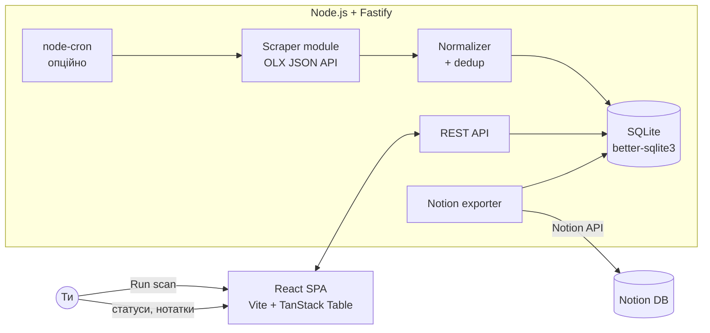
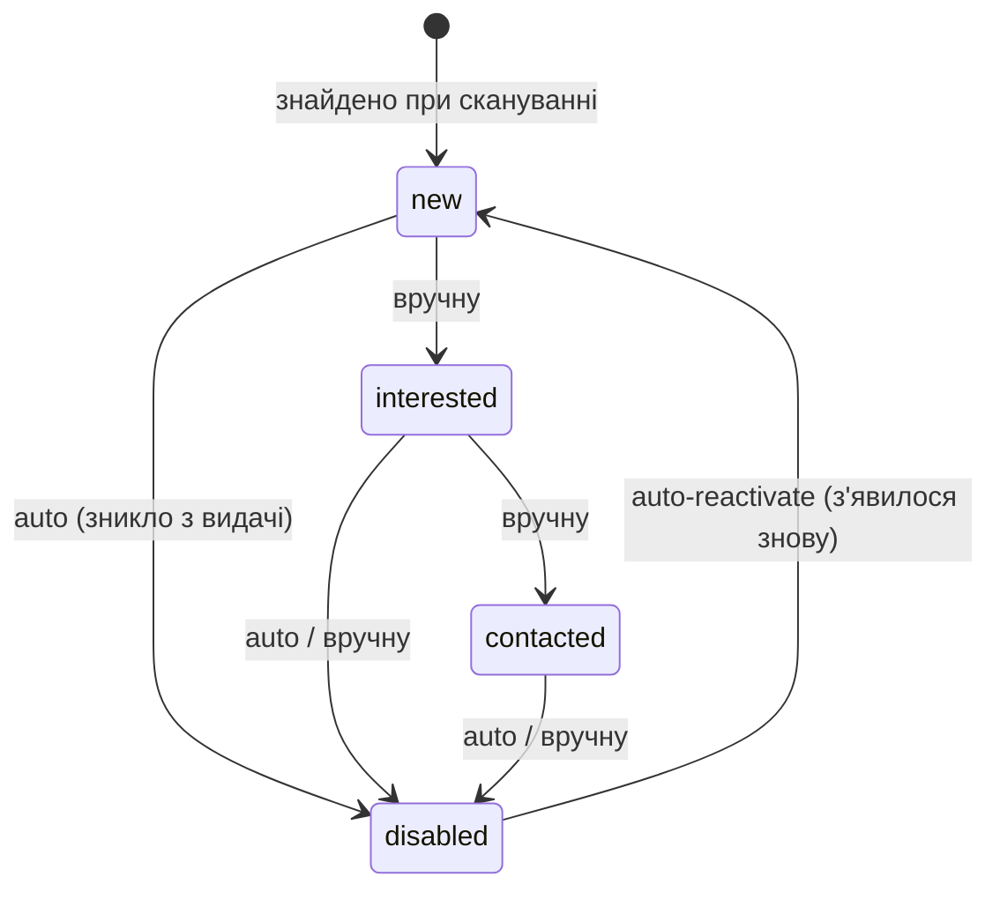

# OLX Monitor — Архітектура та специфікація

> Персональна система моніторингу оголошень OLX.ua: напівавтоматичний збір, таблиця порівняння, статуси, нотатки, історія цін, експорт у Notion.

---

## 1. Загальна концепція

**Гібридний підхід (варіант C):** готова техніка скрейпінгу (прихований JSON API OLX, як у `darkov19/olx-telegram-bot`) + власний бекенд/БД/фронтенд під твій стек (Node.js + React).

**Чому не форк готового проекту цілком:** жоден проект зі звіту не має UI з таблицею, статусами та нотатками. Найближчі (`Parser-of-olx`, `lerdem/olx-parser`) — Python без фронтенду. Дешевше взяти лише їхній підхід до збору даних.

**Масштаб:** 1–5 активних пошуків, 10–100 оголошень на пошук → SQLite достатньо, PostgreSQL не потрібен.

---

## 2. Архітектура



**Потік даних:**
1. Ти створюєш Search (запит + фільтри-діапазони) в UI.
2. Кнопка **Scan** (або cron) → бекенд тягне OLX JSON API посторінково.
3. Normalizer: upsert за `olx_id`, фіксація зміни ціни в `price_history`, оновлення `last_seen_at`.
4. Оголошення, що зникли з видачі → автоматично `disabled`.
5. UI показує таблицю: сортування/фільтри по характеристиках, інлайн-редагування статусу й нотаток.
6. Кнопка **Export to Notion** → створення/синхронізація Notion database.

---

## 3. Технологічний стек

| Шар | Вибір | Чому |
| --- | --- | --- |
| Backend | Node.js 20+, Fastify | Твій основний стек; Fastify легший за Express, вбудована схема-валідація |
| БД | SQLite (`better-sqlite3`) | Локально, 0 конфігурації, синхронний API, файл легко бекапити |
| Збір даних | `fetch` + `cheerio` (static HTML parse) | Підтверджено робочим кодом lerdem; без Playwright; легко на Orange Pi |
| Frontend | React 18 + Vite + TanStack Table + Tailwind | TanStack Table = сортування/фільтри/інлайн-едіт з коробки |
| Стан | TanStack Query | Кеш + рефетч після сканування |
| Планувальник | `node-cron` (опційно, off за замовчуванням) | "Перш за все вручну" |
| Notion | `@notionhq/client` | Офіційний SDK; internal integration token |

---

## 4. Збір даних (Scraper module)

> ✅ Метод підтверджено аналізом робочого коду `lerdem/olx-parser` (UA, Python) та `l-margiela/olx-mcp` (UA, TS) — обидва на станом на 2026 рік.

### 4.1 Основний шлях — static HTML fetch + parse

`lerdem/olx-parser` тягне дані звичайним `requests.get()` (UA реального браузера) і парсить **server-rendered HTML** через lxml — без браузера, без JS-рендерингу. Це підтверджує: проста GET-сторінка пошуку вже містить картки оголошень. Найлегший варіант, добре йде на Orange Pi.

```
GET https://www.olx.ua/d/uk/list/q-macbook-air/
  ?currency=UAH
  &search[order]=created_at:desc
  &search[filter_float_price:from]=15000
  &search[filter_float_price:to]=35000
  &search[private_business]=private        // опційно: тільки приватні
  &view=list
```

Заголовки (з робочого коду lerdem):
```
User-Agent: Mozilla/5.0 (Windows NT 10.0; rv:91.0) Gecko/20100101 Firefox/91.0
Referer: <той самий url>
X-Client: DESKTOP
```

**Парсинг (cheerio), селектори підтверджені в обох проектах:**

| Поле | Селектор |
| --- | --- |
| Картка | `[data-cy="l-card"]` |
| Назва | `[data-cy="l-card"] h6` (або `h4`) |
| Ціна | `[data-testid="ad-price"]` (напр. `"6 000 грн."` → нормалізувати) |
| Лінк | `[data-cy="l-card"] a[href]` (відносний → префікс `https://www.olx.ua`) |
| Дата/локація | `[data-testid="location-date"]` |
| Порожня видача | `[data-cy="empty-state"]` |
| Характеристики (detail) | `[data-cy="ad-params"] li` |
| Опис (detail) | `[data-testid="ad_description"]` |
| Тип продавця | `[data-testid="trader-title"]` (бізнес) |
| Фото CDN | `ireland.apollo.olxcdn.com/v1/files/{id}/image;s=WxH` |

**Правила ввічливості:** затримка 1–2 с між сторінками, ≤3 сторінки на пошук.

Scraper — окремий модуль за інтерфейсом, щоб міняти стратегію без зачіпання решти:

```ts
interface OlxFetcher {
  fetchSearch(search: SearchConfig): Promise<RawListing[]>;       // список
  fetchDetail?(url: string): Promise<RawListingDetail>;           // опц.: характеристики
}
```

### 4.2 Fallback (якщо static HTML почне віддавати порожнечу)

1. Перевірити `__PRERENDERED_STATE__` / `__NEXT_DATA__` у `<script>` сторінки (JSON всередині, без рендерингу JS).
2. Крайній випадок — Playwright з **видимим** Chromium (досвід `sekondly` + `olx-mcp`: headless блокується). Тільки локально на потужнішій машині, не на Pi.

### 4.3 Діапазони характеристик (range-фільтри)

Два рівні (URL-формат підтверджено живим прикладом у коді lerdem):
- **Серверні фільтри OLX** — у самому URL: `search[filter_float_<name>:from]=` / `:to]=` для числових, `search[filter_enum_<name>][0]=` для категорійних, `search[private_business]=private`. Зменшує трафік ще до парсингу.
- **Локальні range-правила** — `searches.local_filters` (JSON), застосовуються Normalizer'ом до розпарсених `params`. Приклад: `{"ram_gb": {"min": 8, "max": 16}, "exclude_keywords": ["на запчастини", "розбитий"]}`. Поза діапазоном → `filtered_out=1` (зберігається, але приховане).

⚠️ Прихований JSON `api/v1/offers/` НЕ використовується (припущення зі звіту стосувалося olx.in, не olx.ua). Прибрано.

---

## 5. Схема БД

```sql
CREATE TABLE searches (
  id INTEGER PRIMARY KEY,
  name TEXT NOT NULL,                -- "MacBook Air M1/M2 Київ"
  query TEXT NOT NULL,
  category_id INTEGER,
  api_filters TEXT DEFAULT '{}',     -- JSON: серверні фільтри OLX
  local_filters TEXT DEFAULT '{}',   -- JSON: range-правила + стоп-слова
  cron_enabled INTEGER DEFAULT 0,
  created_at TEXT DEFAULT (datetime('now'))
);

CREATE TABLE listings (
  id INTEGER PRIMARY KEY,
  olx_id INTEGER NOT NULL UNIQUE,    -- ключ дедуплікації
  search_id INTEGER REFERENCES searches(id),
  title TEXT, url TEXT,
  price REAL, currency TEXT DEFAULT 'UAH',
  city TEXT, district TEXT,
  params TEXT DEFAULT '{}',          -- JSON: всі характеристики з OLX
  photo_url TEXT,
  seller_type TEXT,                  -- private | business
  posted_at TEXT,
  status TEXT DEFAULT 'new'
    CHECK (status IN ('new','interested','contacted','disabled')),
  status_source TEXT DEFAULT 'auto', -- auto | manual
  note TEXT DEFAULT '',
  filtered_out INTEGER DEFAULT 0,
  first_seen_at TEXT DEFAULT (datetime('now')),
  last_seen_at TEXT
);

CREATE TABLE price_history (
  id INTEGER PRIMARY KEY,
  listing_id INTEGER REFERENCES listings(id),
  price REAL NOT NULL,
  observed_at TEXT DEFAULT (datetime('now'))
);

CREATE TABLE scan_runs (
  id INTEGER PRIMARY KEY,
  search_id INTEGER REFERENCES searches(id),
  started_at TEXT, finished_at TEXT,
  found INTEGER, new_count INTEGER, disabled_count INTEGER,
  error TEXT
);
```

---

## 6. Статусна логіка



**Auto-disable:** після сканування — усі listings цього search, чий `olx_id` відсутній у свіжій видачі І `last_seen_at` старший за 2 послідовні скани → `status='disabled', status_source='auto'`. (Буфер у 2 скани захищає від хибних спрацювань при збоях API.)

**Ручний override:** якщо `status_source='manual'` і статус `disabled` — auto-логіка його не реактивує.

---

## 7. REST API бекенду

| Метод | Шлях | Дія |
| --- | --- | --- |
| `GET/POST/PATCH/DELETE` | `/api/searches[/:id]` | CRUD пошуків |
| `POST` | `/api/searches/:id/scan` | Запустити сканування (повертає звіт scan_run) |
| `GET` | `/api/searches/:id/listings?status=&sort=` | Таблиця оголошень |
| `PATCH` | `/api/listings/:id` | `{status?, note?}` — інлайн-редагування |
| `GET` | `/api/listings/:id/price-history` | Дані для спарклайну |
| `POST` | `/api/searches/:id/export/notion` | Експорт/синк у Notion |
| `GET` | `/api/listings/:id/export/markdown` | MD-вивантаження для аналізу в Claude |

---

## 8. Frontend (React)

**Сторінки:**
1. **Searches** — список пошуків, кнопки Scan / Edit / cron toggle, статистика останнього скану.
2. **Listings table** (головна) — TanStack Table:
   - Колонки: фото-мініатюра, назва (лінк на OLX), ціна + Δ ціни (стрілка ↓↑ + спарклайн), ключові характеристики (динамічно з `params`), місто, дата, статус (dropdown), нотатка (інлайн textarea).
   - Фільтри: статус, ціновий діапазон, текстовий пошук; toggle "показати filtered_out".
   - Сортування по будь-якій колонці. Bulk-дії: змінити статус для виділених.
   - Рядки `disabled` — приглушені (opacity).
3. **Listing detail** (drawer) — повний опис, усі params, графік ціни, нотатка.

**Search editor:** форма query + категорія + динамічний конструктор range-фільтрів (поле / min / max) + стоп-слова.

---

## 9. Notion-експорт

- Internal integration token у `.env` (`NOTION_TOKEN`, `NOTION_PARENT_PAGE_ID`).
- Перший експорт: створення Notion database з properties: Title, Price (number), Status (select — мапиться 1:1), City, URL, Note, Posted, Δ Price.
- Повторний: синк за `olx_id` (зберігається як property) — update існуючих, create нових.
- Напрямок **тільки app → Notion** (one-way). Двосторонній синк — поза скоупом v1 (конфлікти не варті складності).

---

## 10. Аналіз через Claude Pro

Ендпойнт `/export/markdown` віддає вибрані оголошення у компактному MD (таблиця + описи) — копіюєш у Claude для семантичного аналізу ("відкинь биті, порівняй, поранжуй"). Без LLM у пайплайні = нуль витрат API, повний контроль.

---

## 11. Структура проекту

```
olx-monitor/
├── CLAUDE.md
├── package.json              # workspaces: server, web
├── server/
│   ├── src/
│   │   ├── index.ts           # Fastify bootstrap
│   │   ├── db/{schema.sql, db.ts}
│   │   ├── scraper/{olxApiFetcher.ts, normalizer.ts, statusEngine.ts}
│   │   ├── routes/{searches.ts, listings.ts, export.ts}
│   │   ├── notion/exporter.ts
│   │   └── cron.ts
│   └── data/olx.db            # gitignored
└── web/
    ├── src/
    │   ├── pages/{Searches.tsx, ListingsTable.tsx}
    │   ├── components/{StatusSelect, NoteCell, PriceSparkline, SearchEditor, ListingDrawer}
    │   └── api/client.ts      # TanStack Query hooks
    └── vite.config.ts
```

---

## 12. Етапи реалізації

| Етап | Скоуп | Критерій готовності |
| --- | --- | --- |
| **MVP (1)** | Scraper (API fetcher) + SQLite + ручний scan через CLI/endpoint + сира таблиця в React | Бачиш 100 оголошень у таблиці, дедуплікація працює |
| **2** | Статуси (ручні + auto-disable), нотатки, інлайн-едіт, локальні range-фільтри | Повний робочий цикл моніторингу |
| **3** | Price history + спарклайни, MD-експорт для Claude | Бачиш динаміку цін |
| **4** | Notion-експорт, node-cron, scan_runs журнал | "Set and forget" |

---

## 13. Ризики

| Ризик | Мітигація |
| --- | --- |
| OLX змінить HTML-розмітку / селектори | Інтерфейс `OlxFetcher` ізолює парсинг; селектори в одному місці; fallback на `__NEXT_DATA__`, далі Playwright headed |
| Rate-limit / бан IP | Затримки 1–2 с, ≤3 стор./пошук, реалістичний UA; сканування рідке |
| Зміна структури `params` між категоріями | `params` зберігається сирим JSON; колонки таблиці — динамічні |
| Хибний auto-disable (збій одного скану) | Буфер 2 послідовні скани + auto-reactivate |
