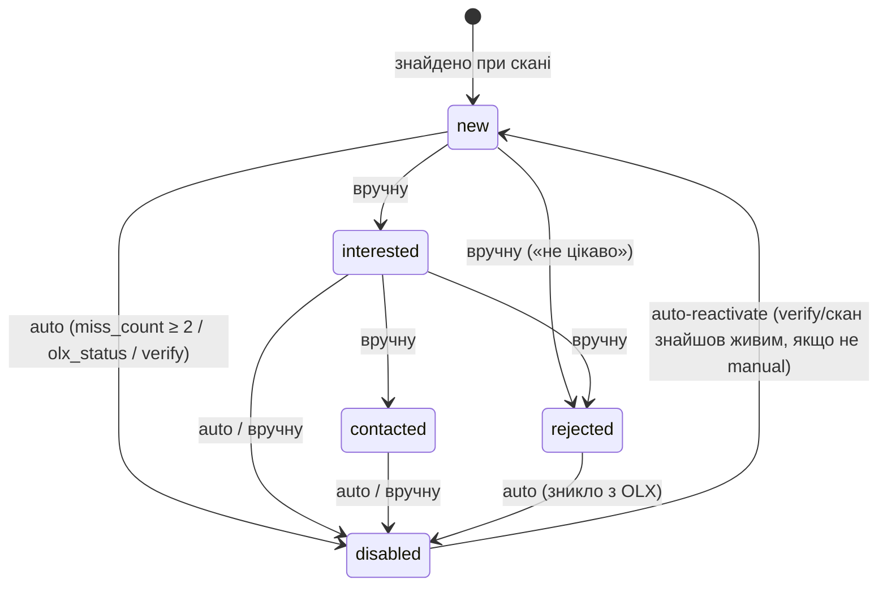

# План: Етап 2 — статуси, нотатки, локальні фільтри, інлайн-едіт

> Прогрес: познач `[x]` коли пункт виконано. Легенда: `[ ]` — заплановано, `[~]` — у роботі, `[x]` — готово.
>
> **Для виконавця:** інваріанти — у [`../../CLAUDE.md`](../../CLAUDE.md) (цей план їх частково
> ЗМІНЮЄ — див. «Зміни канону» внизу; зміни узгоджені з користувачем 2026-06-11).
> Деталі OLX-запитів — [`../olx-api.md`](../olx-api.md). Схема — `server/src/db/schema.sql`.
> Нічого не вигадуй поза цими файлами й цим планом; якщо чогось бракує — зупинись і спитай.

## Context

Етап 1 закритий (GraphQL-first збір, глибокий скан, Chakra UI v3, пагінація). Схема вже
містить поля Етапу 2 (`status`, `status_source`, `note`, `filtered_out`, `local_filters`) —
код їх не наповнює. Цей етап вмикає повний робочий цикл моніторингу: ручні статуси,
авто-disable, нотатки, локальні фільтри, фільтр-панель таблиці.

**Ключова проблема, вирішена дизайном (рішення користувача 2026-06-11):** буквальний
інваріант «відсутній у видачі 2 скани поспіль → disabled» зламаний: звичайний скан покриває
лише перші ~120 позицій видачі, а в БД після глибоких сканів — до ~2000 рядків. Старі
оголошення природно випадають з вікна покриття, хоча на OLX живі → масові false positives.
Обрано **гібрид (варіант C)**: auto-disable лише в межах вікна покриття скану + окремий
ручний **verify-прохід** по сторінках оголошень.

## Рішення (зафіксовані відповіді користувача)

| # | Рішення |
| --- | --- |
| 1 | Auto-disable: гібрид — (b) у зоні покриття на кожному скані + (a) ручний verify-прохід |
| 2 | Verify: кандидати з `last_seen_at` старше **3 днів**, ліміт **≤50** сторінок за прохід |
| 3 | Статуси: + **`rejected`** (ручне «не цікаво»); міграція — **table rebuild** |
| 4 | Локальні фільтри: мінімальний варіант (стоп-слова + числові діапазони), але стоп-слова — **chips/теги**, ключі діапазонів — **випадаючий список** (не ручне вписування) |
| 5 | Ретроактивність: зміна `local_filters` → **одразу перерахувати** `filtered_out` для всіх рядків пошуку |
| 6 | Нотатки: інлайн, якщо це найлегший шлях (Popover з Textarea у комірці); drawer — fallback |
| 7 | Фільтр-панель: статус + toggle filtered_out + **текстовий пошук з підсвіткою** збігів у Title/Description |
| 8 | Bulk-дії: робимо; якщо обсяг розповзеться — остання опційна група, можна відкласти |
| 9 | Лічильник «2 скани поспіль»: тільки успішні скани цього search; deep і normal рівнозначні |
| 10 | `olx_status ≠ active` з видачі → миттєвий auto-disable без буфера (пряме свідчення) |

> ⚠️ **(до п.10, перевірка користувачем):** перед довірою до `olx_status` користувач хоче
> вручну переконатися, що не-`active` у GraphQL-відповіді справді означає неактивне
> оголошення на сайті (відкрити кілька таких URL у браузері). До підтвердження — логіку
> реалізуємо, але в `note`/лог скану писати позначку `auto-disabled: olx_status=<значення>`,
> щоб випадки було легко знайти й перевірити. Після підтвердження — прибрати цей абзац.

## Модель статусів (оновлена)



Правила:
- `rejected` ставиться ТІЛЬКИ вручну (`status_source='manual'`); auto-логіка його не чіпає,
  крім переходу `rejected → disabled` (оголошення реально зникло — факт сильніший за оцінку).
- `status_source='manual'` + `disabled` → auto-reactivate заборонений (як і було).
- Будь-яка ручна зміна статусу → `status_source='manual'`, `miss_count=0`.
- Auto-disable джерела: (1) `miss_count ≥ 2` у вікні покриття; (2) `olx_status ≠ 'active'`
  у видачі — миттєво; (3) verify-прохід виявив мертву сторінку — миттєво.

## Вікно покриття (механіка miss_count)

Працює **лише для GraphQL-сканів** (потрібен сортовний ISO `posted_at`; HTML-fallback
дат не має — fallback-скани auto-disable НЕ запускають, лише оновлюють `last_seen_at`
присутнім).

Після успішного скану (normal або deep):
1. `windowFloor = min(posted_at)` серед отриманих у цьому скані оголошень. Якщо видача
   вичерпана раніше ліміту запитів (остання сторінка `<40`) — `windowFloor = NULL`
   (покрито все: вікно = вся видача).
2. Кандидати: рядки цього search зі `status != 'disabled'`, які НЕ прийшли в цьому скані,
   і (`windowFloor IS NULL` АБО `posted_at >= windowFloor`).
3. Кандидатам `miss_count += 1`; присутнім у видачі — `miss_count = 0`.
4. `miss_count >= 2` і `status_source='auto'` → `status='disabled'`, `disabled_count++`
   у `scan_runs`.

Промо-оголошення можуть випадати з date-порядку — поодинокі хибні інкременти буфер
2 сканів і гасить.

## Verify-прохід (ручний, «Перевірити неактивні»)

- Тригер: кнопка в 3-dot меню пошуку + CLI `npm run scan -- --search <id> --verify`.
- Кандидати: `last_seen_at < datetime('now','-3 days')` AND `status_source='auto'`
  (включно з уже auto-disabled — для реактивації), сортувати за `last_seen_at ASC`,
  ліміт **50**.
- Для кожного: GET `listing.url` (заголовки HTML-fallback з `selectors.ts`). Детект:
  - HTTP 404/410 → мертве;
  - HTTP 200 → шукати маркер неактивності в HTML. ⚠️ **Точний маркер визначити live при
    реалізації** (відкрити збережене-видалене оголошення, зняти розмітку) і задокументувати
    в `olx-api.md` (нова §3.4 «Сторінка оголошення: детект неактивності»); до того — стоп
    і питання користувачу зі зразком HTML.
- Мертве → `status='disabled', status_source='auto'` (миттєво). Живе → `last_seen_at=now`,
  `miss_count=0`, якщо було auto-disabled → `status='new'` (auto-reactivate).
- Ввічливість: ті самі константи що deep scan — батчі по 3, пауза 3–6 с між батчами,
  1–2 с всередині.
- Журнал: рядок у `scan_runs` з `kind='verify'`; прогрес через існуючі
  `requests_done`/`requests_total` + `GET /api/searches/:id/scan-status`; UI — той самий
  прогрес-бар, що для deep.

## Зміни схеми

- [ ] `listings`: **table rebuild** (нове значення CHECK + нова колонка):
  - `status` CHECK → `('new','interested','contacted','rejected','disabled')`;
  - нова колонка `miss_count INTEGER DEFAULT 0`.
  - Міграція в `db.ts` через `PRAGMA user_version`: version `<2` → у транзакції
    `CREATE TABLE listings_new (… нова схема …)` → `INSERT INTO listings_new SELECT …,0 FROM listings`
    → `DROP TABLE listings` → `ALTER TABLE listings_new RENAME TO listings` → відтворити
    індекси → `PRAGMA user_version = 2`. (`addColumnIfMissing` НЕ підходить — міняється CHECK.)
- [ ] `scan_runs`: `kind TEXT DEFAULT 'normal'` (`normal|deep|verify`) — через `addColumnIfMissing`.
- [ ] Новий індекс: `CREATE INDEX IF NOT EXISTS idx_listings_search_status ON listings(search_id, status);`
- [ ] `schema.sql` оновити (канон для нових БД) синхронно з міграцією.

Формат `searches.local_filters` (JSON):

```json
{
  "exclude_keywords": ["на запчастини", "розбитий"],
  "ranges": { "<param_key>": { "min": 8, "max": 16 } }
}
```

`exclude_keywords` — case-insensitive substring по `title` + очищеному `description`.
`ranges` — по числовому значенню, видобутому з `params[key]` label (parseFloat першого
числа в рядку; не парситься → правило до рядка не застосовується, filtered_out не ставити).

## Група A — Backend

### A1. Статуси й нотатки

- [ ] `server/src/types.ts`: `ListingStatus = 'new'|'interested'|'contacted'|'rejected'|'disabled'`;
  розширити `ListingRow` (`miss_count`); тип `ListingPatch { status?, note? }`.
- [ ] Новий роут `server/src/routes/listings.ts`: `PATCH /api/listings/:id`
  body `{status?, note?}` — валідація статусу по enum; будь-яка зміна статусу →
  `status_source='manual'`, `miss_count=0`. Повертає оновлений рядок.
- [ ] `GET /api/searches/:id/listings`: додати query `status?` (фільтр) і
  `include_filtered?` (за замовчуванням `filtered_out=0` ховаються — УЗГОДИТИ нижче з B3:
  фільтрація клієнтська, тому простіше повертати все і фільтрувати на фронті; рішення —
  повертати все, серверний `status` лишити нереалізованим).

### A2. statusEngine (вікно покриття)

- [ ] Новий `server/src/scraper/statusEngine.ts`: `applyScanStatuses(searchId, fetched: RawListing[], exhausted: boolean)` —
  логіка «Вікно покриття» вище, в одній транзакції. Повертає `{disabled_count}`.
- [ ] `scanner.ts`: викликати після upsert ТІЛЬКИ якщо працював GraphQL-фетчер
  (не fallback) і скан успішний; писати `disabled_count` у `scan_runs`.
- [ ] `normalizer.ts`/фетчер: прокинути ознаку `exhausted` (остання сторінка `<40`).
- [ ] Миттєвий disable по `olx_status`: в upsert — якщо прийшов `status ≠ 'active'` і
  `status_source='auto'` → `status='disabled'` + лог-позначка
  `auto-disabled: olx_status=<x>` (див. ⚠️ перевірку користувача вище).

### A3. Verify-прохід

- [ ] `server/src/scraper/verifier.ts`: вибірка кандидатів (правила вище), GET сторінок
  батчами (константи з deep scan), детект мертвих (маркер — live при реалізації, СТОП
  якщо маркер не визначається), застосування статусів. Прогрес через `onProgress`.
- [ ] `scanner.ts`: `runScan(searchId, { verify: true })` → гілка verifier, `scan_runs.kind='verify'`.
- [ ] `routes/searches.ts`: `POST /api/searches/:id/scan?verify=true`.
- [ ] `scan.ts` CLI: прапорець `--verify`.
- [ ] `olx-api.md`: нова §3.4 «Сторінка оголошення: детект неактивності» (запит, маркери,
  дата верифікації).

### A4. Локальні фільтри

- [x] `server/src/scraper/localFilters.ts`: `evaluate(localFilters, listing) → boolean`
  (filtered_out чи ні) — одна чиста функція, юніт-перевірена вручну на прикладах.
- [x] `normalizer.ts`: при insert/update обчислювати `filtered_out` через `evaluate`.
- [x] `routes/searches.ts`: `PATCH /api/searches/:id` приймає `local_filters` →
  у транзакції зберегти + перерахувати `filtered_out` для ВСІХ рядків пошуку
  (synchronous loop по rows, better-sqlite3 потягне ≤2000 рядків).
- [x] Новий `GET /api/searches/:id/param-keys` → `[{key, name, sample}]` — distinct ключі
  з `listings.params` цього пошуку (для дропдауна конструктора діапазонів). `name` брати
  ніде (в БД лише `{key: label}`) → повертати `key` + 2-3 sample-значення.

### A5. Stats для панелі дій

- [x] `routes/searches.ts`: `GET /api/searches/:id/stats` →
  ```json
  {
    "in_db": 167,
    "stale_count": 42,
    "last_scan": { "kind": "normal", "finished_at": "...", "found": 145,
                   "new_count": 3, "disabled_count": 1, "error": null }
  }
  ```
  `stale_count` — кандидати verify (та сама вибірка, що в A3: `last_seen_at` старше 3 днів
  + `status_source='auto'`); `last_scan` — останній рядок `scan_runs`. Три прості SQL-запити.

## Група B — Frontend

### B1. Колонка «Статус» + нотатки

- [ ] `types/index.ts` + `client.ts`: `useUpdateListing()` (PATCH, оптимістичний апдейт
  кешу `['listings', searchId]`), статус-enum, лейбли/кольори:
  `new` (blue) / `interested` (green) / `contacted` (purple) / `rejected` (gray) /
  `disabled` (red, приглушений).
- [ ] `columns.tsx`: колонка «Статус» — Chakra `Menu` або `NativeSelect` у комірці
  (компактний Badge-тригер); рядки зі `status='disabled'` або `'rejected'` — `opacity 0.5`.
- [ ] Колонка «Нотатка»: показ обрізано (`lineClamp 2`); клік → `Popover` з `Textarea`
  (autofocus) + кнопка «Зберегти» (PATCH). Якщо Popover у комірці конфліктує з таблицею —
  fallback: поле нотатки в існуючому `DescriptionDialog`.

### B2. Фільтр-панель таблиці

- [ ] Панель над таблицею (`ListingsTable.tsx`): сегмент-фільтр статусів
  (Всі / new / interested / contacted / rejected / disabled — з лічильниками),
  Switch «показати відфільтровані» (filtered_out), `Input` текстового пошуку.
- [ ] Фільтрація клієнтська: TanStack `globalFilter` (кастомна fn по title + очищеному
  description, case-insensitive) + column filter по status + предикат filtered_out.
  `autoResetPageIndex` скине пагінацію сам.
- [ ] **Підсвітка збігів**: компонент `HighlightText` (split по запиту, збіги —
  `<Mark>`/`<chakra.mark>` з фоном `yellow.subtle`) — застосувати в комірках Title і
  Description (і в тултіпі опису).

### B3. Редактор локальних фільтрів

- [ ] `SearchFiltersDrawer.tsx` (3-dot меню пошуку → «Фільтри»):
  - Стоп-слова: chips/теги (Chakra `Tag` з close-кнопкою) + input «додати слово» (Enter);
  - Діапазони: рядки [дропдаун ключа (з `GET param-keys`) | min | max | видалити] +
    кнопка «додати правило»;
  - Зберегти → `PATCH local_filters` → toast «Перераховано: N приховано».
- [ ] Рядки `filtered_out=1` за замовчуванням приховані; при ввімкненому Switch —
  показані з візуальною позначкою (іконка фільтра в рядку).

### B4. Панель дій пошуку (явні кнопки + фідбек)

Замість пунктів сканування в 3-dot меню — **постійна панель дій** для вибраного пошуку
(над таблицею, в `App.tsx` поруч із лічильниками; у 3-dot меню лишити тільки
«Видалити» і «Фільтри»):

- [ ] **Рядок стану** (дані з `GET /api/searches/:id/stats`, рефетч після кожної дії):
  `На OLX: 1 258 · У базі: 167 · Давно не бачених: 42` + другий рядок
  `Останній скан: <відносний час> (<швидкий|глибокий|перевірка>) · +N нових · M вимкнено`
  (якщо `last_scan.error` — іконка ⚠ з tooltip-текстом помилки).
- [ ] **Три кнопки** (Button з іконкою + текстом, НЕ IconButton; під кожною — дрібний
  підпис-пояснення):
  - `LuRefreshCw` **«Швидкий скан»** — підпис «~10 с · новинки зверху видачі»;
  - `LuLayers` **«Глибокий скан»** — підпис «~1–2 хв · вся видача вглиб»;
  - `LuStethoscope` **«Перевірити неактивні (N)»** — N = `stale_count`; підпис
    «~1 хв · заходить на сторінки старих оголошень»; `disabled` якщо N=0
    (tooltip «Немає оголошень, що потребують перевірки»).
- [ ] Усі кнопки блокуються, поки триває будь-яка дія цього пошуку.
- [ ] **Прогрес-бар** «Запит X/Y · ~Z с» — для **всіх трьох** режимів (зараз лише deep;
  normal — короткий, але хай теж показує; той самий `useScanStatus`-поллінг).
- [ ] **Toast після завершення** — різний текст за режимом:
  - швидкий: «Знайдено 145 · нових 3 · вимкнено 1»;
  - глибокий: «32 запити · знайдено 1 240 · нових 210 · вимкнено 4»;
  - перевірка: «Перевірено 42 · мертвих 5 · реактивовано 1».
  Помилка (включно з fallback-позначкою) → toast type warning з суттю.
- [ ] Verify повертає `{checked, dead, reactivated}` у `ScanResult` (узгодити з A3).

### B5. Автооновлення + пояснювальні діалоги

**Автооновлення (клієнтське):**

- [ ] `SettingsDrawer`: новий розділ «Автооновлення» — Switch (дефолт **вимкнено**) +
  селектор інтервалу `15 / 30 / 60 хв`. Персист у `SETTINGS_STORAGE_KEY`
  (`autoRefreshEnabled`, `autoRefreshIntervalMin`).
- [ ] Механіка: `setInterval` поки вкладка відкрита (новий хук `useAutoRefresh`):
  **швидкий скан** для всіх пошуків **послідовно** (не паралельно — ввічливість до OLX),
  пауза 5–10 с між пошуками. Пропустити тік, якщо вкладка прихована
  (`document.visibilityState !== 'visible'`) або вже триває будь-який скан/verify.
- [ ] Фідбек: toast на старті тіку («Автооновлення: сканую N пошуків…») і підсумковий
  («Автооновлення: +X нових across N пошуків»; якщо 0 нових — тихий/короткий toast).
  Рядок стану і таблиця оновлюються через стандартну інвалідацію кешу.
- [ ] Індикатор у шапці: маленький бейдж «авто: 30 хв» поруч із шестернею, коли ввімкнено.
- [ ] Глибокий скан і verify автооновлення НІКОЛИ не запускає — лише швидкий.
- [ ] (Довідка: серверний node-cron з Етапу 4 — окремий headless-механізм, цим пунктом
  не скасовується; клієнтське автооновлення працює лише з відкритою вкладкою.)

**Пояснювальні діалоги перед діями:**

- [ ] Швидкий скан — без підтвердження (легка дія, є toast після).
- [ ] **Глибокий скан** — `DialogRoot` (патерн діалогу видалення): «Глибокий скан зробить
  до ~{ceil(visible_total_count/40) || 50} запитів до OLX з паузами (~{оцінка} хв) і
  додасть у базу оголошення з глибини видачі. Продовжити?» + Checkbox «Більше не питати»
  (персист `skipDeepScanConfirm` у settings).
- [ ] **Перевірити неактивні** — аналогічний діалог: «Буде відкрито до {N} сторінок
  давно не бачених оголошень (~{оцінка} хв). Мертві → disabled, живі → оновлення/
  реактивація. Продовжити?» + «Більше не питати» (`skipVerifyConfirm`).
- [ ] Обидва діалоги переюзають один компонент `ConfirmActionDialog` (title, body,
  confirmLabel, skipKey).

### B6. Bulk-дії (опційна група — якщо обсяг етапу розповзається, відкласти ЦЮ групу)

- [ ] TanStack row selection: колонка-чекбокс (header = select all on page).
- [ ] Панель «N вибрано»: дропдаун «змінити статус на…» → серія PATCH (або loop на
  фронті; окремий bulk-ендпойнт НЕ робити — зайва поверхня).

## Група C — Документація

- [ ] `CLAUDE.md` — «Зміни канону» (див. нижче) перенести в секцію інваріантів.
- [ ] `docs/olx-monitor-spec.md` §6 — нова діаграма статусів + вікно покриття + verify.
- [ ] `docs/architecture.md` — statusEngine/verifier/localFilters у таблиці модулів,
  нові ендпойнти, сценарій verify.
- [ ] `docs/structure.md` — нові файли.
- [ ] `docs/olx-api.md` §3.4 — детект неактивної сторінки (після live-зняття маркера).
- [ ] `docs/plans/TODO` — «Закінчити всі фази» не чіпати; цей план лінкнути.

## Зміни канону (для перенесення в CLAUDE.md)

1. Статуси: `new|interested|contacted|rejected|disabled`; `rejected` — лише ручний.
2. Auto-disable: **вікно покриття** (windowFloor по `posted_at` поточного скану) +
   `miss_count ≥ 2`; лише успішні GraphQL-скани; fallback-скани логіку не запускають.
3. `olx_status ≠ active` → миттєвий auto-disable (позначка для ручної перевірки —
   тимчасово, див. ⚠️ у плані).
4. Verify-прохід: ручний, кандидати `last_seen_at > 3 днів` + `status_source='auto'`,
   ≤50 сторінок, батч-патерн deep scan, миттєвий disable/reactivate за результатом.
5. Ручна зміна статусу → `status_source='manual'`, `miss_count=0`; manual-disabled
   не реактивується автоматично.
6. `local_filters`: зміна правил → синхронний ретроактивний перерахунок `filtered_out`
   усіх рядків пошуку.

## Верифікація / test-cases (перевіряє користувач вручну)

- [ ] `npm run build` без помилок; міграція user_version=2 на живій БД проходить,
  дані не втрачені (`select count(*)` до/після).
- [ ] Зміна статусу в таблиці зберігається (перезавантаження), `status_source='manual'`.
- [ ] `rejected` рядок приглушений; auto-логіка його не реактивує.
- [ ] Нотатка: додати/відредагувати/очистити — персистується.
- [ ] Auto-disable: на пошуку з частим churn (iphone 13) після 2 сканів зникле з перших
  сторінок свіже оголошення → disabled; старі рядки поза вікном покриття НЕ disabled.
- [ ] HTML-fallback-скан (зіпсувати GRAPHQL_URL) → жодних змін статусів.
- [ ] Verify: відкрити 2-3 URL, які verify вимкнув, у браузері — справді неактивні
  (заодно ручна перевірка ⚠️ по `olx_status`).
- [ ] Стоп-слово «чохол» → рядки зникають; Switch показує їх з позначкою; видалення
  слова повертає (ретроактивний перерахунок в обидва боки).
- [ ] Текстовий пошук: збіги підсвічені в Title і Description; пагінація скидається.
- [ ] Панель дій: три кнопки з підписами видимі для вибраного пошуку; «Перевірити (N)»
  показує реальне число і disabled при N=0; прогрес-бар працює в усіх трьох режимах;
  toast-розбори відповідають режиму; рядок стану оновлюється одразу після дії.
- [ ] Діалоги підтвердження: глибокий скан і verify показують пояснення з оцінкою
  запитів/часу; «Більше не питати» зберігається після перезавантаження; швидкий скан
  модалки не показує.
- [ ] Автооновлення: увімкнути 15 хв → бейдж у шапці; на тіку — toast старту і підсумку,
  пошуки скануються послідовно; прихована вкладка пропускає тік; вимкнення зупиняє
  інтервал; глибокий/verify автоматично НЕ запускаються.
- [ ] Bulk (якщо реалізовано): select all on page → зміна статусу → всі PATCH пройшли.

## Інваріанти / обмеження

- Стек незмінний. **Нових npm-залежностей не додавати** (підсвітка — власний компонент,
  не `react-highlight-words`).
- Playwright не запускати; verify — звичайний `fetch`.
- UI-текст українською, код англійською, TS strict без `any`.
- Серверні зміни — мінімальна поверхня: 2 нові роути (`PATCH listings`, `param-keys`),
  1 query-прапорець (`verify=true`).

## Коміти

По групах: `feat: listing statuses, notes & PATCH endpoint` → `feat: coverage-window
auto-disable engine` → `feat: manual verify pass for stale listings` → `feat: local
filters with retroactive recompute` → `feat: table filter panel with text highlight` →
(`feat: bulk status actions`). Після кожної групи — запропонувати текст коміту.
